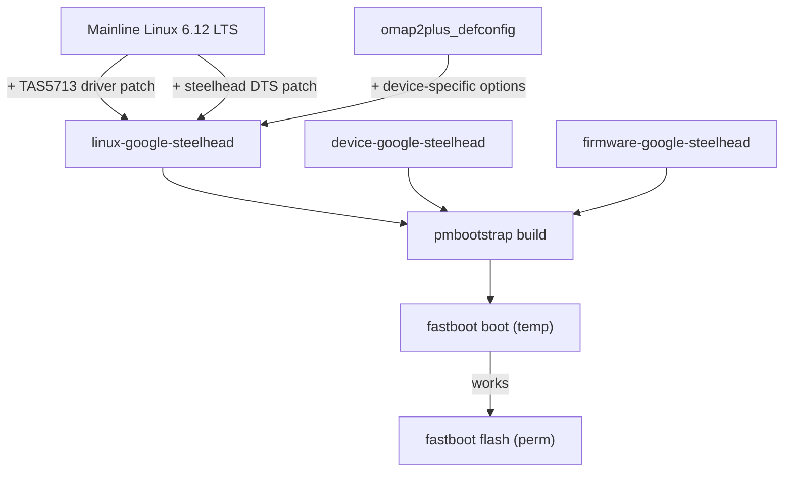
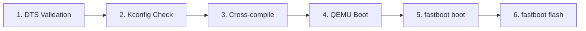

# Nexus Q postmarketOS Port

## Target Device: Google Nexus Q (Steelhead)

Spherical digital media player (4.6" diameter, ~923g), manufactured by Google in the USA, released June 2012. Codename **steelhead**. Headless embedded device -- no screen, no keyboard, no battery.

### Hardware Component Map

- **SoC**: TI OMAP4460 -- dual-core ARM Cortex-A9 @ 1.2 GHz, PowerVR SGX540 GPU (unused, software rendering only)
- **RAM**: 1 GB LPDDR2 (Elpida ECB240ABACN) at 0x80000000
- **Storage**: 16 GB eMMC (Samsung KLMAG4FEJA-A002)
- **PMIC**: TI TWL6030 + TPS62361 (I2C1, addr 0x48)
- **Audio codec**: TI TWL6040 (I2C1, addr 0x4b) -- McPDM to ABE
- **Audio amplifier**: TI TAS5713 25W Class-D (I2C4, addr 0x1b) -- McBSP2 I2S, drives banana jack speakers
- **WiFi**: Broadcom BCM4330 (SDIO on MMC5, WLAN_EN=GPIO43, IRQ=GPIO53)
- **Bluetooth**: Broadcom BCM4330 (UART2, BT_EN=GPIO46, BT_RESET=GPIO52)
- **NFC**: NXP PN544 (I2C3, addr 0x28, IRQ=GPIO164, EN=GPIO163)
- **Ethernet**: SMSC LAN9500A USB-to-10/100 (USB EHCI Port 1, NRESET=GPIO62)
- **HDMI**: OMAP4 DSS via TPD12S015A (CT_CP_HPD=GPIO60, LS_OE=GPIO41, HPD=GPIO63), micro-HDMI Type D
- **LED ring**: AVR MCU (I2C2, addr 0x20) -> LP5523 LED drivers (32 RGB LEDs)
- **Optical audio**: S/PDIF via McASP -> TOSLINK
- **Temperature**: TI TMP101 (I2C2, addr 0x48)
- **USB**: Micro-USB service port (OMAP4 USB OTG via MUSB)
- **Ports**: Micro-HDMI, Ethernet RJ-45, Micro-USB, TOSLINK, Banana jack L+R, AC power

### Boot Modes

- **Normal boot**: Power on -- circulating blue LED ring
- **Fastboot mode**: Cover mute LED during power-on -- solid red LED ring. Always reachable via hardware.
- **Recovery mode**: Cover mute LED at boot, use volume dome to scroll

**Anti-brick safety**: Fastboot is hardware-triggered (capacitive sensor), independent of any software partition. Device is unbrickable as long as `bootloader` partition is never overwritten.

### Partition Safety

- `bootloader` -- **NEVER FLASH** (bricks the device)
- `boot` -- kernel + ramdisk -- safe, always recoverable via fastboot
- `system` -- rootfs -- safe, always recoverable via fastboot
- `recovery`, `userdata`, `cache` -- safe

## Strategy




### Key Design Decisions

- **Mainline kernel 6.12 LTS** (not the downstream 3.0.31 that Galaxy Nexus uses) -- modern driver framework, long-term support
- **Device-specific kernel package** (`linux-google-steelhead`) rather than shared `linux-postmarketos-mainline` -- needed because no OMAP4 device in pmaports uses the shared kernel, and we have custom DTS + TAS5713 patches
- **Boot parameters from Galaxy Nexus (samsung-maguro)** -- validated identical offsets: kernel=0x00008000, ramdisk=0x01000000, tags=0x00000100, pagesize=2048
- **Firmware from maguro pattern** -- `firmware-aosp-broadcom-wlan` + device-specific `bcmdhd.cal` for BCM4330
- **Console is `ttyS2`** (not `ttyO2`) -- mainline 8250 OMAP driver since kernel 3.19 uses `ttyS*` naming
- **omap2plus_defconfig as base** -- hand-written configs miss critical OMAP4 subsystem deps (pinctrl, clocks, DMA, interconnect, voltage domains)
- **WiFi/BT DTS compatible strings** must use two-string format: `"brcm,bcm4330-fmac", "brcm,bcm4329-fmac"` (specific + generic fallback per kernel binding docs)
- **McBSP2 pad offsets** must NOT overlap with McPDM pads (0x106/0x108/0x10a are McPDM, used by omap4-mcpdm.dtsi for TWL6040). Correct McBSP2 offsets must be verified against OMAP4460 TRM (SWPU235).

## Files to Create

### postmarketOS Packages (`pmos/`)

- `**device-google-steelhead/APKBUILD`** -- device package, depends on `linux-google-steelhead`, `mkbootimg`, `postmarketos-base`, `mesa-dri-gallium`
- `**device-google-steelhead/deviceinfo`** -- codename, arch=armv7, flash_method=fastboot, boot offsets, `console=ttyS2,115200n8`, DTB path, USB networking
- `**device-google-steelhead/modules-initfs**` -- omap_hsmmc, smsc95xx, omapdss, omapdrm, tpd12s015
- `**linux-google-steelhead/APKBUILD**` -- mainline 6.12 LTS kernel, references config + 3 patches
- `**firmware-google-steelhead/APKBUILD**` -- depends on `firmware-aosp-broadcom-wlan`, installs `bcmdhd.cal`

### Kernel Artifacts (`kernel/`)

- `**dts/omap4-steelhead.dts**` -- complete device tree (OMAP4460, TWL6030/6040, TAS5713, BCM4330, PN544, LAN9500A, LP5523, HDMI, all pinmux)
- `**configs/steelhead_defconfig**` -- based on omap2plus_defconfig + device-specific drivers + postmarketOS requirements
- `**patches/0001-ASoC-tas571x-add-TAS5713-support.patch**` -- add TAS5713 to mainline tas571x codec driver
- `**patches/0002-dt-bindings-add-ti-tas5713.patch**` -- add ti,tas5713 to DT binding YAML
- `**patches/0003-ARM-dts-omap4-add-steelhead.patch**` -- add DTS file to kernel tree + Makefile

### Build Scripts

- `**build-and-flash.sh**` -- pmbootstrap init/build/install/export + fastboot workflow

### Reference Files (informational)

- `**README.md**` -- project overview, hardware table, quick start
- `**firmware/README.md**` -- how to extract BCM4330 firmware from device

## Testing Pipeline




### Stage 1: DTS Validation (no hardware)

```bash
make ARCH=arm CROSS_COMPILE=arm-linux-gnueabihf- dtbs
make ARCH=arm CROSS_COMPILE=arm-linux-gnueabihf- dtbs_check
make ARCH=arm dt_binding_check DT_SCHEMA_FILES=sound/ti,tas571x.yaml
```

Catches: wrong compatible strings, invalid properties, phandle errors, Makefile issues.

### Stage 2: Kconfig Validation (no hardware)

```bash
pmbootstrap kconfig check linux-google-steelhead
```

Validates config against postmarketOS requirements (cgroups, namespaces, devtmpfs, etc.).

### Stage 3: Cross-compile (no hardware)

```bash
pmbootstrap build linux-google-steelhead
pmbootstrap build device-google-steelhead
```

Catches: compile errors, missing includes, driver build failures.

### Stage 4: QEMU Boot Test (no hardware)

QEMU `vexpress-a9` emulates Cortex-A9 (same core as OMAP4460). Tests kernel boot, initramfs, userspace (Sway, PipeWire). Does NOT test device-specific peripherals.

```bash
pmbootstrap init  # select qemu-vexpress, armv7, sway
pmbootstrap install
pmbootstrap qemu --image-size=2G
# SSH: ssh -p 2222 user@127.0.0.1
```

### Stage 5: Temporary Boot (real hardware, non-destructive)

```bash
pmbootstrap install
pmbootstrap export
fastboot boot /tmp/postmarketOS-export/boot.img
```

Loads kernel+ramdisk into RAM without writing to flash. Power-cycle reverts to original. Tests: OMAP4460 boot, HDMI output, USB networking, serial console.

### Stage 6: Permanent Flash (real hardware, reversible)

```bash
pmbootstrap flasher flash_kernel
pmbootstrap flasher flash_rootfs
```

Always recoverable via fastboot mode (cover mute LED during power-on).

### What QEMU Cannot Test (hardware only)

HDMI, WiFi/BT (BCM4330), audio amp (TAS5713), LED ring (AVR+LP5523), Ethernet (LAN9500A), NFC (PN544), eMMC timing, TWL6030 power sequencing. All safe to test via `fastboot boot`.