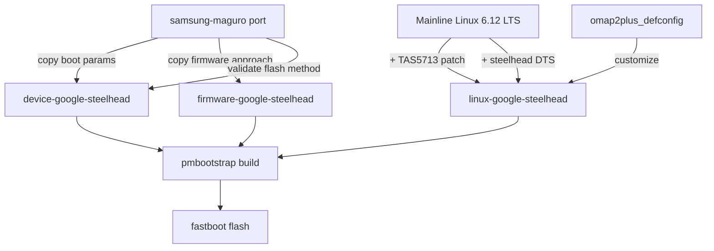

# Nexus Q postmarketOS Port - Revised Plan (Maguro-Based)

## Context

We have confirmed the actual `samsung-maguro` (Galaxy Nexus) postmarketOS port structure from `pmaports`. Key findings:

- **Maguro uses a downstream 3.0.31 kernel** (`linux-samsung-maguro` from LineageOS `android_kernel_samsung_tuna`). We will NOT use this ancient kernel.
- **Maguro boot offsets are identical** to Nexus Q (same OMAP4460 memory layout): kernel=`0x00008000`, ramdisk=`0x01000000`, tags=`0x00000100`, pagesize=`2048`.
- **Maguro firmware uses `firmware-aosp-broadcom-wlan`** + a device-specific `bcmdhd.cal` calibration file for the BCM4330. Our current approach uses `linux-firmware-brcm` which is incorrect.
- **No OMAP4 device in pmaports uses the shared `linux-postmarketos-mainline`** kernel - all use device-specific kernels. Our `linux-google-steelhead` approach is correct.
- **The mainline kernel has no DTS for Galaxy Nexus or Nexus Q** (only PandaBoard, Droid 4, etc.), so our custom DTS is required.
- `**linux-postmarketos-mainline` is now at 7.0-rc1** for armv7. Our kernel target of 6.6.60 should be bumped to **6.12 LTS** (current long-term support) for better OMAP4 support.

## Strategy




## Changes Required

### 1. Fix `device-google-steelhead/APKBUILD` ([pmos/device-google-steelhead/APKBUILD](pmos/device-google-steelhead/APKBUILD))

Current issues:

- `depends` includes `u-boot-tools` - Nexus Q uses stock Android bootloader, not U-Boot
- `depends` missing `mkbootimg` - required for generating boot images (maguro has it)
- `nonfree_firmware()` uses `linux-firmware-brcm` - should use `firmware-google-steelhead` (our own package, modeled on `firmware-samsung-maguro`)

Changes:

- Remove `u-boot-tools`, add `mkbootimg` to depends
- Change `nonfree_firmware()` depends to `firmware-google-steelhead`

### 2. Fix `device-google-steelhead/deviceinfo` ([pmos/device-google-steelhead/deviceinfo](pmos/device-google-steelhead/deviceinfo))

Current issues:

- Has `deviceinfo_bootimg_qcdt="false"` and `deviceinfo_bootimg_dtb_second="false"` - Qualcomm-specific, not in maguro, should be removed
- `deviceinfo_flash_offset_base` is present but maguro doesn't have it - keep it (OMAP4 specific, harmless)

Changes:

- Remove `deviceinfo_bootimg_qcdt` and `deviceinfo_bootimg_dtb_second` lines

### 3. Create `firmware-google-steelhead/APKBUILD` (NEW file, modeled on [firmware-samsung-maguro](https://raw.githubusercontent.com/SakuraKyuo-open-source/pmaports/master/device/testing/firmware-samsung-maguro/APKBUILD))

The maguro firmware package:

- Depends on `firmware-aosp-broadcom-wlan` (provides BCM4330 NVRAM and firmware blobs)
- Installs a device-specific `bcmdhd.cal` calibration file to `/lib/firmware/postmarketos/bcmdhd/bcm4330/`

We need an equivalent for steelhead:

- Same `firmware-aosp-broadcom-wlan` dependency
- Extract steelhead-specific `bcmdhd.cal` from the original Android firmware partition

### 4. Bump kernel version in `linux-google-steelhead/APKBUILD` ([pmos/linux-google-steelhead/APKBUILD](pmos/linux-google-steelhead/APKBUILD))

- Change `pkgver=6.6.60` to `pkgver=6.12.12` (latest 6.12 LTS point release)
- Update source URL from `v6.x` to `v6.x` (still correct for 6.12)
- Generate a proper kernel config starting from mainline `omap2plus_defconfig` and adding our customizations

### 5. Generate kernel config from `omap2plus_defconfig` ([kernel/configs/steelhead_defconfig](kernel/configs/steelhead_defconfig))

The current hand-written defconfig (267 lines) is likely missing many critical OMAP4 options. The correct approach:

- Start from mainline `arch/arm/configs/omap2plus_defconfig`
- Apply our customizations on top (BCM4330 WiFi/BT, TAS5713, LP5523, PN544, USB Ethernet, postmarketOS requirements)
- This ensures all OMAP4 subsystem dependencies are correctly resolved

### 6. Create missing patch files

Two patches referenced in `linux-google-steelhead/APKBUILD` don't exist yet:

- `**0002-dt-bindings-add-ti-tas5713.patch**`: Add TAS5713 compatible string to `Documentation/devicetree/bindings/sound/ti,tas571x.yaml`
- `**0003-ARM-dts-omap4-add-steelhead.patch**`: Add `omap4-steelhead.dts` to `arch/arm/boot/dts/ti/omap/` and the Makefile

### 7. Update build/flash scripts

- Update [bootloader/build-and-flash.sh](bootloader/build-and-flash.sh) to use correct pmbootstrap workflow
- Target device codename: `google-steelhead`
- Flash method: `fastboot` (matching maguro)

## File Summary


| File                                      | Action     | Key Change                                           |
| ----------------------------------------- | ---------- | ---------------------------------------------------- |
| `pmos/device-google-steelhead/APKBUILD`   | Edit       | Remove u-boot-tools, add mkbootimg, fix firmware dep |
| `pmos/device-google-steelhead/deviceinfo` | Edit       | Remove Qualcomm-specific fields                      |
| `pmos/firmware-google-steelhead/APKBUILD` | Create     | BCM4330 calibration (from maguro template)           |
| `pmos/linux-google-steelhead/APKBUILD`    | Edit       | Bump to 6.12 LTS                                     |
| `kernel/configs/steelhead_defconfig`      | Regenerate | Base on omap2plus_defconfig                          |
| `kernel/patches/0002-*.patch`             | Create     | DT bindings for TAS5713                              |
| `kernel/patches/0003-*.patch`             | Create     | Add steelhead DTS to kernel tree                     |
| `bootloader/build-and-flash.sh`           | Edit       | Fix pmbootstrap workflow                             |


## Build Workflow (pmbootstrap)

```bash
# 1. Install pmbootstrap
pip3 install pmbootstrap

# 2. Initialize (creates chroot, clones pmaports)
pmbootstrap init
# Select: vendor=google, device=steelhead, UI=sway

# 3. Copy our packages into pmaports
PMAPORTS=$(pmbootstrap config aports)
cp -r pmos/device-google-steelhead "$PMAPORTS/device/testing/"
cp -r pmos/linux-google-steelhead "$PMAPORTS/device/testing/"
cp -r pmos/firmware-google-steelhead "$PMAPORTS/device/testing/"

# 4. Build
pmbootstrap build device-google-steelhead
pmbootstrap install

# 5. Flash via fastboot
pmbootstrap flasher flash_kernel
pmbootstrap flasher flash_rootfs
```

