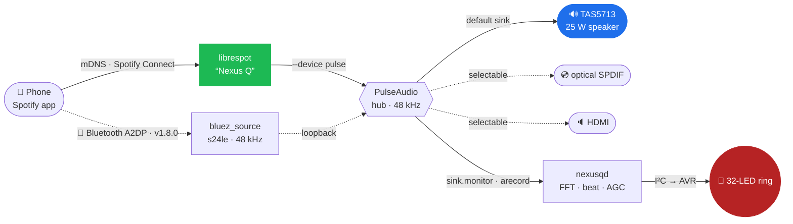

<div align="center">

# 🛸 Nexus Q&nbsp;Reloaded

### Google's glowing orb from 2012 — reborn on **mainline Linux**.

[](https://github.com/petronijus/nexusQ-reloaded/releases)
[](kernel/)
[](https://postmarketos.org)
[](#-hardware)
[](INSTALL.md)
[](LICENSE)

A discontinued Android curio with no apps, no recovery, and a sealed bootloader —
turned into a **dual-core postmarketOS media player** with Spotify&nbsp;Connect,
**Bluetooth A2DP**, a beat-reactive **32-LED ring**, a Wayland desktop, a
1.2&nbsp;GHz CPU, **NFC tap-to-send**, and a **phone/desktop companion remote**.

[**Install**](INSTALL.md) · [**Releases**](https://github.com/petronijus/nexusQ-reloaded/releases) · [**Changelog**](CHANGELOG.md) · [**The story**](#-first-light)

</div>

---

## ✨ What it is

The **Nexus Q** (codename `steelhead`) was Google's mysterious 2012 media sphere:
a TI OMAP4460, a 25&nbsp;W amplifier, a ring of 32 RGB LEDs, and an Android build
that did almost nothing. Google cancelled it before it ever really shipped.

**Nexus Q Reloaded** throws away the Android stack and boots a **mainline Linux
6.12 LTS** kernel under **postmarketOS** — reverse-engineering the factory kernel
where mainline fell short, and bringing the orb back as something genuinely useful.

> It plays music. It glows in time. It runs `python3`, `ssh`, and a desktop. On a
> phone from before the original was even released.

---

## 🎯 What works

| Subsystem | Status | Notes |
|---|:---:|---|
| 🐧 **Boot** — mainline 6.12 + postmarketOS (systemd) | ✅ | daily-usable from a clean flash · **genuinely clean boot log** — 0 failed units, `dmesg` err/warn EMPTY, and `journalctl -b -p warning` down to only 4 documented-external lines (all ~15 v1.6.9 residual err/warn lines root-caused + fixed · was 3 externals v1.6.10–v1.8.1; a 4th — a one-shot NM vendored-libsystemd assert at the RTC→NTP clock jump — was dispositioned 2026-07-13) · v1.6.10 |
| ⚡ **Dual-core SMP** | ✅ | both Cortex-A9 cores online (`nproc=2`) · since v1.2.0 |
| 🚄 **CPU freq scaling** 350 → **1200 MHz** | ✅ | DVFS · v1.4.0 · governor **`conservative`** since **v1.8.2** — a measured 2026-07-13 idle study showed `ondemand` kept 74 % of idle at ≥700 MHz on microburst wakeups (~1000/s); `conservative` won the A/B/C test and idle now **settles at 350 MHz** (56.7 % residency, 4.25 trans/s). History: `conservative` v1.5.0–v1.6.5 → `ondemand` v1.6.6–v1.8.1 → `conservative` v1.8.2 (this time measurement-backed) |
| 🔊 **TAS5713 25 W speaker** | ✅ | **audible since v1.6.13** (kernel r36). The software pipeline (driver/PCM/softvol, correct pitch — 2× clock bug) landed v1.6.1, but the physical amp was **silent through every earlier release**: `mcbsp2_pins` muxed the wrong balls (`abe_dmic_*`), so the McBSP2 I2S clock/data/frame never reached the amp (`aplay` rc=0, nothing driven). Root-caused + fixed in DTS 2026-07-07 (stock pads `0x0f6/0x0fa/0x0fc` MUX_MODE0) → user-confirmed audible. Now one selectable PulseAudio output (**v1.6.15**, shipped in v1.7.0). The residual playback **crackle is CLOSED 2026-07-12 — it was TWO independent faults, both fixed** (hardware-verified, user-confirmed perfectly clean playback): (a) load-correlated bus/DMA contention → kernel **r41** patch **0041** (sDMA `CCR_READ_PRIORITY` on the cyclic audio channel + GCR `HI_THREAD_RESERVED=1`; verified `GCR=0x00011010`, ch20 CCR bit6=1); (b) a metronomic ~1/s click from **two free-running crystals** — mainline reparented the DPLL_ABE reference to sys_32k while the TAS5713 MCLK sat on the 38.4 MHz crystal (~21 ppm ≈ 1 sample slip/s @ 48 kHz) → kernel **r42** patch **0042** relocks DPLL_ABE from `sys_clkin` at exactly 98.304 MHz, the stock topology the bootloader sets and our port was undoing. See `docs/2026-07-12-audio-crackle-closed-sdma-priority-and-dpll-abe.md` (+ the 07-08/07-09 diagnosis notes) |
| 🎵 **Spotify Connect** (librespot) | ✅ | advertises **"Nexus Q"**, streams over 5 GHz · v1.6.1 · **now a PulseAudio input** (systemd user unit → `--device pulse`), one movable PA sink-input · v1.6.15 |
| 🔊 **Audio output selection** (speaker / optical / HDMI) | ✅ | **v1.6.15** (shipped in v1.7.0): PulseAudio is the hub, the active output = the PA default sink, picked from the companion app (`listOutputs`/`setOutput` → `pactl set-default-sink` + move all sink-inputs + class-D amp safety toggle). Input-agnostic + future-proof (BT-A2DP / Tidal / casting can join as further PA inputs) |
| 🔴 **LED music visualizer** | ✅ | the ring dances to the beat · v1.6.2 · **5 selectable visualisations** + breathing color themes · idle-keepalive (no more dark-after-idle AVR starvation) · v1.6.5 · **volume-independent** — re-tapped to the active output's PA monitor + an AGC (auto-gain) so it reacts to the music at any listening volume, no low-volume flicker · v1.6.15 · **tap now gated on playback** so the amp sink suspends when idle (idle CPU ~7 % → ~1 %) · v1.7.1 |
| 📱 **Companion app** + LAN control bridge | ✅ | Flutter remote → `nexusq-control` (TCP 45015, mDNS): volume · breathing LED theme + brightness · **visualisation picker** · now-playing · v1.6.3 · reachable over WiFi · v1.6.5 · **output selector** (Holo-dark segmented control) + volume/mute now act on the active PA sink · v1.6.15 · **NFC tap-to-send receiver** (HCE — the Q taps a message onto the phone, shown as a SnackBar) + **auto-reconnect on resume/drop** (no more app-kill after backgrounding) · v1.7.0 · **two-way volume sync** — the app slider now tracks the **physical dome dial** and the LXQt applet (bridge `pactl subscribe` → `volumeChanged`) · v1.7.3 (verified live, not yet in a flashed image) |
| 🖥 **HDMI desktop** (LXQt · Wayland) | ✅ | labwc + Pixman renderer · **desktop audio sink fixed v1.6.12** (the red-cross no-sink tray icon: PA now starts via a native systemd USER unit — Alpine ships none and the XDG autostart never fires under systemd+Wayland — and the sole sink is the TAS5713 speaker) |
| 📶 **WiFi** (BCM4330, 5 GHz) | ✅ | NetworkManager, factory MAC pinned at the NM layer (stable on-air MAC since v1.6.6 — but the router can still reassign the DHCP lease, seen 2026-07-12: find the device by hostname `steelhead`/MAC, don't hardcode the IP). **Characterized 2026-07-07: 5 GHz is healthy — NOT flaky** (−48 dBm, 0 discarded/retry pkts, 2.6 ms jitter, 0 % loss); bulk **~34 Mbit/s is a hardware ceiling** of the 2010-era 1×1 802.11n BCM4330 (not a bug — same cipher does ~80 over ethernet, so WiFi is the limit; ~100× the appliance's need). Use **ethernet for bulk** |
| 🔵 **Bluetooth** + **A2DP audio** (BCM4330) | ✅ | **A2DP sink reliable since v1.8.0** — pair a phone and stream to the Q (`phone → BT → PulseAudio bluez_source s24le/48 kHz → TAS5713`). Root cause of every past "won't stay connected / phantom Connected / corrupt-burst audio" was a **missing BT HCI UART `max-speed`**: the BCM4330 HCI runs over UART2 and `hci_bcm` left `oper_speed=0`, never syncing the host UART to the firmware baud → `hci0: Frame reassembly failed (-84)` (EILSEQ) + tx timeouts. Kernel **patch 0040** sets `max-speed = <3000000>` (stock ran 3 Mbaud); verified live — reassembly failures 0 (was 26+), controller addr correct. (NOT coexistence, NOT HFP/SCO — both earlier wrong guesses.) Per-device **BD_ADDR** `F8:8F:CA:20:49:E5` since v1.6.10 (DTS `local-bd-address` + btbcm patch 0036) |
| 🔐 **SSH** (USB-gadget + WiFi) | ✅ | RNDIS net `172.16.42.1` + ACM console. On v1.6.5 only `user@` works; key-based `root@` is baked in + verified 2026-07-03 (ships in v1.6.6) |
| 🐍 **python3** on-device | ✅ | flash-verified · v1.6.0 |
| 🌡 **TMP101 temperature sensor** | ✅ | |
| 📡 **NFC tap-to-send** (PN544) | ✅ | **tap-to-send shipped v1.7.0** (2026-07-08, verified on device): tap a phone on the dome → the Q pushes a short text over NFC, shown in the companion app. **Reverse-HCE** — the PN544 can't host-card-emulate (no SE) and Android Beam is gone, so the phone runs the HCE service and the **Q is the ISO-DEP reader** (`nexusq-nfc-send` daemon, AID `F0010203040506`). Key enabler: kernel **patch 0037** RATS-activates any ISO-DEP target (was DESFire-only), so a modern HCE phone (SAK 0x20) is finally reachable. The chip itself was **fixed 2026-07-03** (v1.6.6) — the DTS had muxed the wrong pads (dpm_emu debug pads instead of `usbb2_ulpitll_dat1/2/3`), found via a stock RAM-boot probe. See `docs/2026-07-08-nfc-tap-to-send-reverse-hce.md` |
| 🔈 **HDMI audio** | 🟠 | needs a sink with audio EDID (the card is a dummy-DAI — PA ignores it via a `PULSE_IGNORE` udev rule, so no more boot-log noise · v1.6.9); joins the output selector as `hdmi` once that rule is lifted against a real audio sink (TV/AVR) — UNTESTED |
| 🌐 **Ethernet** (LAN9500A) | ✅ | **works from a cold boot — task #17 fully closed** (gold-validated: clean flash + true cold power-cycle → `eth0` 100Mbps/Full, 0 failed units). The "enumeration intermittency" was a **pinmux miss**: `gpio_1` NENABLE (the LAN9500A power-enable) sat on an **unmuxed pad** (`kpd_col2` @ padconf `0x186`) so it never powered the chip — the healthy USB3320 PHY masked it, and the earlier "3/3 vs 0/3 boots" was stock priming, not a race. Fixed in kernel `#33` (DTS pad mux); the 2500ms "settle" it superseded was a false positive · **v1.6.8**. NM layer resolved 2026-07-04 (baked `eth-lan` DHCP + `eth-direct` static `ssh root@10.42.0.2`). **Now the DEFAULT deploy/control path** (measured 2026-07-07: ~80 Mbit/s, 0.62 ms — faster + more stable than WiFi/USB-gadget, fixed IP; the direct-cable static profile auto-comes-up since device r29 · v1.6.12). Chip has no MAC EEPROM → random MAC/lease per boot on a LAN |
| 💿 **TOSLINK / SPDIF** | ✅ | **brought up in v1.6.13** — no C driver (mainline `davinci-mcasp` DIT/IEC958): defconfig `SND_SOC_DAVINCI_MCASP=m`+`SND_SOC_SPDIF=m`, DTS `&mcasp0` + `mcasp_spdif_pins` (`0x0f8` MUX_MODE2, AXR0) + `sound_spdif` card. Probe `-EINVAL` fixed via `format="i2s"`+mcasp master. A selectable PA output ("Optický výstup") since **v1.6.15**; PA pinned to 48 kHz (`50-nexusq-48k.conf`) so the DIT locks (44.1 kHz → "off by 88435 PPM"). Both PA sinks report 48000 Hz on fresh boot |
| 🎧 **TWL6040 headset codec** | ⚪ | not populated/unused on steelhead — the stock kernel never drove it (verified 2026-07-03); no headset path **by design** (was wrongly called "dead hardware") |

<sub>Full per-milestone detail in [CHANGELOG.md](CHANGELOG.md) · hardware map &amp; roadmap in [PLAN.md](PLAN.md).</sub>

---

## 🎵 The signal path

How a tap on your phone becomes sound **and** light — the heart of the v1.6.x work:



Since **v1.6.15** **PulseAudio is the hub**: librespot feeds it as one input
(`--device pulse`), and the active **output** — TAS5713 speaker, optical SPDIF, or
HDMI — is the PA default sink, chosen from the companion app. The LED daemon reads
the active sink's **monitor**, runs an FFT with an auto-gain stage, and animates the
ring — so the orb glows in time with whatever you're playing, at any volume. (Before
v1.6.15 the stream was teed via an ALSA `type multi` to the amp + a snd-aloop
loopback; the McBSP2 pinmux fix in v1.6.13 was what first made the physical amp
audible at all.)

Since **v1.6.3** a phone/desktop **companion app** auto-discovers the Q over mDNS and
controls **volume** (since v1.6.15 the active PA output's sink; input-agnostic), the
**audio output** (speaker / optical / HDMI · v1.6.15), the **LED color theme +
brightness**, the **music visualisation**, **mute** (with a device-side mute-LED indicator),
and shows **now-playing** — talking to the on-device `nexusq-control` LAN bridge (TCP 45015,
line-delimited JSON — reachable over WiFi since **v1.6.5**). Since **v1.6.5** a color theme
is a *breathing override* (the ring gently pulses in the theme's hue, always visible) while a
separate picker chooses one of the **5 music-reactive visualisations** shown while audio
plays. The Flutter app is installed on the phone, **not** in the device image.

---

## 🚀 Quick start

Grab the [latest release](https://github.com/petronijus/nexusQ-reloaded/releases/latest), then:

```bash
# 1. Enter fastboot: unplug power, cover the top mute-LED sensor with your palm,
#    plug power back in. The ring turns solid red.

# 2. Decompress the rootfs and flash
zstd -d nexusq-rootfs-v*-sparse.img.zst
fastboot flash boot      nexusq-boot-v*.img
fastboot -S 100M flash userdata nexusq-rootfs-v*-sparse.img   # -S chunking is REQUIRED

# 3. Power-cycle without covering the sensor. Tux → kernel → desktop.
```

Then open Spotify on the same WiFi and cast to **"Nexus Q"** 🎶. Full walkthrough in
**[INSTALL.md](INSTALL.md)**.

---

## 🧩 Hardware

| Component | Chip | Driver | Bus |
|---|---|---|---|
| SoC | TI **OMAP4460** (Cortex-A9 ×2) | `omap4` | — |
| Audio amp | TI **TAS5713** 25 W Class-D | `snd-soc-tas571x` | McBSP2 / I²C4 |
| Audio codec | — (TWL6040 pad unpopulated/unused; stock never drove it) | none — removed from DTS/defconfig | — |
| WiFi | Broadcom **BCM4330** | `brcmfmac` | SDIO / MMC5 |
| Bluetooth | Broadcom BCM4330 | `hci_bcm` | UART2 |
| NFC | NXP PN544 | `pn544_i2c` | I²C3 |
| Ethernet | SMSC LAN9500A | `smsc95xx` | USB EHCI |
| HDMI | OMAP4 DSS + TPD12S015A | `omapdrm` | DSS |
| LED ring | AVR MCU (32 RGB) | `leds-steelhead-avr` | I²C2 |
| PMIC | TI TWL6030 | `twl-core` | I²C1 |

---

## 🛠 Build from source

One command, fully dockerized (pmbootstrap under the hood):

```bash
./docker-build.sh        # → output/boot.img + output/google-steelhead.img
```

It builds the kernel (mainline 6.12.12 + **42 patches** in `kernel/patches/`), the
local `python3` override, `nexusqd`, and a full systemd rootfs, then repacks a
ramdisk-less boot image and verifies the result by **mounting** it. Build notes and
the hard-won gotchas live in `HANDOFF.md`.

```
kernel/      dts · defconfig · 42 mainline patches (the DTS ships VIA the patches — edit a patch, not just kernel/dts/)
pmos/        device-google-steelhead · linux-google-steelhead · firmware · nexusqd · python3
userspace/   nexusqd — the LED-ring daemon (driver, screensaver, music visualizer)
reverse-eng/ ground truth extracted from the factory kernel
scripts/     diagnostics (nq-healthd, nq-collect, …)
docs/        dated engineering record
raw2simg.py  byte-exact all-RAW Android-sparse converter
```

---

## 🗺 Milestones

```
0.1.0 ── first full boot, HDMI, WiFi, LED ring                       2026-06-10
1.1.0 ── ethernet alive                                              2026-06-22
1.2.0 ── ✦ dual-core SMP                                             2026-06-23
1.3.0 ── ethernet hardened                                          2026-06-24
1.4.0 ── ✦ cpufreq DVFS → 1.2 GHz                                    2026-06-26
1.5.0 ── first full host-built rootfs                               2026-06-27
1.6.0 ── ✦ python3 on-device (the flash-bug saga)                   2026-06-28
1.6.1 ── ✦ TAS5713 audio fixed + Spotify Connect baked in           2026-06-29
1.6.2 ── ✦ LED music visualizer reacts to playback                 2026-06-30
1.6.3 ── ✦ companion app + LAN control bridge                       2026-06-30
1.6.5 ── ✦ breathing themes + 5 visualisations · LED keepalive · companion/WiFi   2026-07-01
1.6.6 ── ✦ NFC fixed (pinmux) · boot-error cleanup · factory MAC on air     2026-07-04
1.6.7 ── ✦ baked ethernet NM profiles · led_static healthd guard            2026-07-05
1.6.8 ── ✦ ethernet works from cold — unmuxed NENABLE pad (task #17 closed)          2026-07-06
1.6.9 ── ✦ boot log clean — gkr-pam + HDMI-audio noise silenced                      2026-07-06
1.6.10 ─ ✦ boot log GENUINELY clean — dmesg err/warn EMPTY (all ~15 lines fixed)  2026-07-06
1.6.13 ─ ✦ TAS5713 speaker finally AUDIBLE (McBSP2 pinmux) + SPDIF bring-up      2026-07-07
1.6.15 ─ ✦ PA-centric audio: multi-input → PulseAudio → app-selectable output · LED AGC   2026-07-07
1.6.16 ─ ✦ physical volume dial → PulseAudio + tray icon follows output           2026-07-07
1.7.0 ── ✦ NFC tap-to-send (reverse-HCE, Q → phone) · companion auto-reconnect   2026-07-08
1.8.0 ── ✦ Bluetooth A2DP reliable (BT UART max-speed, patch 0040) · crackle isolated to output path   2026-07-10
1.8.1 ── ✦ playback crackle CLOSED — sDMA read-priority (r41) + DPLL_ABE sys_clkin relock (r42)   hardware-verified 2026-07-12
1.8.2 ── ✦ idle power — conservative governor + healthd/pid-1 churn fixes (idle settles at 350 MHz)   2026-07-13   ← latest
```

<sub>(v1.7.4 was an unusable crackle-bake artifact — never shipped; v1.8.0 is its working successor.)</sub>

---

## 📸 First light

<div align="center">


<sub><i>Where it started: Tux and a mainline 6.12 kernel reaching the Nexus Q's HDMI output<br>(an early 2026 milestone — the root filesystem came a few commits later).</i></sub>

</div>

---

## 📜 License

[**GPL-2.0**](LICENSE) — this repository carries Linux kernel patches, a device tree,
and a defconfig, all derivative works of the Linux kernel (GPLv2).

<div align="center">
<sub>Built with stubbornness for a sphere that deserved better. 🛸</sub>
</div>
