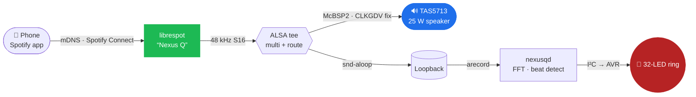

<div align="center">

# 🛸 Nexus Q&nbsp;Reloaded

### Google's glowing orb from 2012 — reborn on **mainline Linux**.

[](https://github.com/petronijus/nexusQ-reloaded/releases)
[](kernel/)
[](https://postmarketos.org)
[](#-hardware)
[](INSTALL.md)
[](LICENSE)

A discontinued Android curio with no apps, no recovery, and a sealed bootloader —
turned into a **dual-core postmarketOS media player** with Spotify&nbsp;Connect,
a beat-reactive **32-LED ring**, a Wayland desktop, a 1.2&nbsp;GHz CPU, and a
**phone/desktop companion remote**.

[**Install**](INSTALL.md) · [**Releases**](https://github.com/petronijus/nexusQ-reloaded/releases) · [**Changelog**](CHANGELOG.md) · [**The story**](#-first-light)

</div>

---

## ✨ What it is

The **Nexus Q** (codename `steelhead`) was Google's mysterious 2012 media sphere:
a TI OMAP4460, a 25&nbsp;W amplifier, a ring of 32 RGB LEDs, and an Android build
that did almost nothing. Google cancelled it before it ever really shipped.

**Nexus Q Reloaded** throws away the Android stack and boots a **mainline Linux
6.12 LTS** kernel under **postmarketOS** — reverse-engineering the factory kernel
where mainline fell short, and bringing the orb back as something genuinely useful.

> It plays music. It glows in time. It runs `python3`, `ssh`, and a desktop. On a
> phone from before the original was even released.

---

## 🎯 What works

| Subsystem | Status | Notes |
|---|:---:|---|
| 🐧 **Boot** — mainline 6.12 + postmarketOS (systemd) | ✅ | daily-usable from a clean flash · **clean boot log** — 0 failed units, the last cosmetic gkr-pam + HDMI-audio log noise silenced · v1.6.9 |
| ⚡ **Dual-core SMP** | ✅ | both Cortex-A9 cores online (`nproc=2`) · since v1.2.0 |
| 🚄 **CPU freq scaling** 350 → **1200 MHz** | ✅ | DVFS · v1.4.0 (governor `ondemand` again — verified on device 2026-07-03, ships in v1.6.6; was `conservative` v1.5.0–v1.6.5) |
| 🔊 **TAS5713 25 W speaker** | ✅ | correct pitch — the 2× clock bug is fixed · v1.6.1 |
| 🎵 **Spotify Connect** (librespot) | ✅ | advertises **"Nexus Q"**, streams over 5 GHz · v1.6.1 |
| 🔴 **LED music visualizer** | ✅ | the ring dances to the beat · v1.6.2 · **5 selectable visualisations** + breathing color themes · idle-keepalive (no more dark-after-idle AVR starvation) · v1.6.5 |
| 📱 **Companion app** + LAN control bridge | ✅ | Flutter remote → `nexusq-control` (TCP 45015, mDNS): volume · breathing LED theme + brightness · **visualisation picker** · now-playing · v1.6.3 · reachable over WiFi · v1.6.5 |
| 🖥 **HDMI desktop** (LXQt · Wayland) | ✅ | labwc + Pixman renderer |
| 📶 **WiFi** (BCM4330, 5 GHz) | ✅ | NetworkManager. On v1.6.5 the DHCP IP wanders (NM randomized-MAC → fresh lease per boot — that was the 2026-07-02 "dead WiFi" scare); **fixed + verified on device 2026-07-03** (stable MAC/IP, ships in v1.6.6 — which pins the **factory MAC** at the NM layer, verified on air, since brcmfmac ignores the nvram `macaddr=`) |
| 🔵 **Bluetooth** (BCM4330) | ✅ | |
| 🔐 **SSH** (USB-gadget + WiFi) | ✅ | RNDIS net `172.16.42.1` + ACM console. On v1.6.5 only `user@` works; key-based `root@` is baked in + verified 2026-07-03 (ships in v1.6.6) |
| 🐍 **python3** on-device | ✅ | flash-verified · v1.6.0 |
| 🌡 **TMP101 temperature sensor** | ✅ | |
| 📡 **NFC** (PN544) | ✅ | **fixed 2026-07-03** — the DTS muxed the wrong pads (dpm_emu debug pads instead of `usbb2_ulpitll_dat1/2/3`), so the chip only *looked* dead; found via a stock RAM-boot probe + live stock pinmux dump. Clean `nfc_en` polarity detect, `nfc0` registers · ships in v1.6.6 · **live RF test 2026-07-04**: repeated card detections + data frames (follow-up: a long-lived NFC userspace) |
| 🔈 **HDMI audio** | 🟠 | needs a sink with audio EDID (the card is a dummy-DAI — PA now ignores it via a `PULSE_IGNORE` udev rule, so no more boot-log noise · v1.6.9) |
| 🌐 **Ethernet** (LAN9500A) | ✅ | **works from a cold boot — task #17 fully closed** (gold-validated: clean flash + true cold power-cycle → `eth0` 100Mbps/Full, 0 failed units). The "enumeration intermittency" was a **pinmux miss**: `gpio_1` NENABLE (the LAN9500A power-enable) sat on an **unmuxed pad** (`kpd_col2` @ padconf `0x186`) so it never powered the chip — the healthy USB3320 PHY masked it, and the earlier "3/3 vs 0/3 boots" was stock priming, not a race. Fixed in kernel `#33` (DTS pad mux); the 2500ms "settle" it superseded was a false positive · **v1.6.8**. NM layer resolved 2026-07-04 (baked `eth-lan` DHCP + `eth-direct` static `ssh root@10.42.0.2`). Chip has no MAC EEPROM → random MAC/lease per boot on a LAN |
| 💿 **TOSLINK / SPDIF** | ⬜ | not wired up yet |
| 🎧 **TWL6040 headset codec** | ⚪ | not populated/unused on steelhead — the stock kernel never drove it (verified 2026-07-03); no headset path **by design** (was wrongly called "dead hardware") |

<sub>Full per-milestone detail in [CHANGELOG.md](CHANGELOG.md) · hardware map &amp; roadmap in [PLAN.md](PLAN.md).</sub>

---

## 🎵 The signal path

How a tap on your phone becomes sound **and** light — the heart of the v1.6.x work:



The same stream is **teed** to the amplifier and to a virtual loopback; the daemon
that drives the LEDs reads the loopback, runs an FFT, and animates the ring — so the
orb glows in time with whatever you're playing. The speaker is the timing master, so
the lights never stall the music.

Since **v1.6.3** a phone/desktop **companion app** auto-discovers the Q over mDNS and
controls **volume** (one ALSA softvol shared with Spotify-Connect), the **LED color theme +
brightness**, the **music visualisation**, **mute** (with a device-side mute-LED indicator),
and shows **now-playing** — talking to the on-device `nexusq-control` LAN bridge (TCP 45015,
line-delimited JSON — reachable over WiFi since **v1.6.5**). Since **v1.6.5** a color theme
is a *breathing override* (the ring gently pulses in the theme's hue, always visible) while a
separate picker chooses one of the **5 music-reactive visualisations** shown while audio
plays. The Flutter app is installed on the phone, **not** in the device image.

---

## 🚀 Quick start

Grab the [latest release](https://github.com/petronijus/nexusQ-reloaded/releases/latest), then:

```bash
# 1. Enter fastboot: unplug power, cover the top mute-LED sensor with your palm,
#    plug power back in. The ring turns solid red.

# 2. Decompress the rootfs and flash
zstd -d nexusq-rootfs-v*-sparse.img.zst
fastboot flash boot      nexusq-boot-v*.img
fastboot -S 100M flash userdata nexusq-rootfs-v*-sparse.img   # -S chunking is REQUIRED

# 3. Power-cycle without covering the sensor. Tux → kernel → desktop.
```

Then open Spotify on the same WiFi and cast to **"Nexus Q"** 🎶. Full walkthrough in
**[INSTALL.md](INSTALL.md)**.

---

## 🧩 Hardware

| Component | Chip | Driver | Bus |
|---|---|---|---|
| SoC | TI **OMAP4460** (Cortex-A9 ×2) | `omap4` | — |
| Audio amp | TI **TAS5713** 25 W Class-D | `snd-soc-tas571x` | McBSP2 / I²C4 |
| Audio codec | — (TWL6040 pad unpopulated/unused; stock never drove it) | none — removed from DTS/defconfig | — |
| WiFi | Broadcom **BCM4330** | `brcmfmac` | SDIO / MMC5 |
| Bluetooth | Broadcom BCM4330 | `hci_bcm` | UART2 |
| NFC | NXP PN544 | `pn544_i2c` | I²C3 |
| Ethernet | SMSC LAN9500A | `smsc95xx` | USB EHCI |
| HDMI | OMAP4 DSS + TPD12S015A | `omapdrm` | DSS |
| LED ring | AVR MCU (32 RGB) | `leds-steelhead-avr` | I²C2 |
| PMIC | TI TWL6030 | `twl-core` | I²C1 |

---

## 🛠 Build from source

One command, fully dockerized (pmbootstrap under the hood):

```bash
./docker-build.sh        # → output/boot.img + output/google-steelhead.img
```

It builds the kernel (mainline 6.12.12 + **32 patches** in `kernel/patches/`), the
local `python3` override, `nexusqd`, and a full systemd rootfs, then repacks a
ramdisk-less boot image and verifies the result by **mounting** it. Build notes and
the hard-won gotchas live in `HANDOFF.md`.

```
kernel/      dts · defconfig · 32 mainline patches
pmos/        device-google-steelhead · linux-google-steelhead · firmware · nexusqd · python3
userspace/   nexusqd — the LED-ring daemon (driver, screensaver, music visualizer)
reverse-eng/ ground truth extracted from the factory kernel
scripts/     diagnostics (nq-healthd, nq-collect, …)
docs/        dated engineering record
raw2simg.py  byte-exact all-RAW Android-sparse converter
```

---

## 🗺 Milestones

```
0.1.0 ── first full boot, HDMI, WiFi, LED ring                       2026-06-10
1.1.0 ── ethernet alive                                              2026-06-22
1.2.0 ── ✦ dual-core SMP                                             2026-06-23
1.3.0 ── ethernet hardened                                          2026-06-24
1.4.0 ── ✦ cpufreq DVFS → 1.2 GHz                                    2026-06-26
1.5.0 ── first full host-built rootfs                               2026-06-27
1.6.0 ── ✦ python3 on-device (the flash-bug saga)                   2026-06-28
1.6.1 ── ✦ TAS5713 audio fixed + Spotify Connect baked in           2026-06-29
1.6.2 ── ✦ LED music visualizer reacts to playback                 2026-06-30
1.6.3 ── ✦ companion app + LAN control bridge                       2026-06-30
1.6.5 ── ✦ breathing themes + 5 visualisations · LED keepalive · companion/WiFi   2026-07-01
1.6.6 ── ✦ NFC fixed (pinmux) · boot-error cleanup · factory MAC on air     2026-07-04
1.6.7 ── ✦ baked ethernet NM profiles · led_static healthd guard            2026-07-05
1.6.8 ── ✦ ethernet works from cold — unmuxed NENABLE pad (task #17 closed)          2026-07-06
1.6.9 ── ✦ boot log is now clean — gkr-pam + HDMI-audio noise silenced       ← latest  2026-07-06
```

---

## 📸 First light

<div align="center">


<sub><i>Where it started: Tux and a mainline 6.12 kernel reaching the Nexus Q's HDMI output<br>(an early 2026 milestone — the root filesystem came a few commits later).</i></sub>

</div>

---

## 📜 License

[**GPL-2.0**](LICENSE) — this repository carries Linux kernel patches, a device tree,
and a defconfig, all derivative works of the Linux kernel (GPLv2).

<div align="center">
<sub>Built with stubbornness for a sphere that deserved better. 🛸</sub>
</div>
