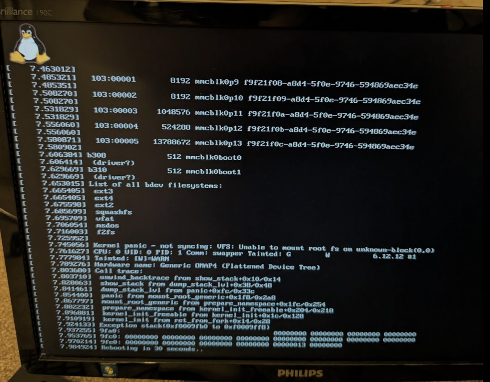

<div align="center">

# 🛸 Nexus Q&nbsp;Reloaded

### Google's glowing orb from 2012 — reborn on **mainline Linux**.

[](https://github.com/petronijus/nexusQ-reloaded/releases)
[](kernel/)
[](https://postmarketos.org)
[](#-hardware)
[](#-flashing--unbrickable-by-design)
[](LICENSE)

A discontinued Android curio with no apps, no recovery, and a sealed bootloader —
turned into a **dual-core postmarketOS media player** with Spotify&nbsp;Connect,
a beat-reactive **32-LED ring**, a Wayland desktop, and a 1.2&nbsp;GHz CPU.

[**Install**](INSTALL.md) · [**Releases**](https://github.com/petronijus/nexusQ-reloaded/releases) · [**Changelog**](CHANGELOG.md) · [**The story**](#-first-light)

</div>

---

## ✨ What it is

The **Nexus Q** (codename `steelhead`) was Google's mysterious 2012 media sphere:
a TI OMAP4460, a 25&nbsp;W amplifier, a ring of 32 RGB LEDs, and an Android build
that did almost nothing. Google cancelled it before it ever really shipped.

**Nexus Q Reloaded** throws away the Android stack and boots a **mainline Linux
6.12 LTS** kernel under **postmarketOS** — reverse-engineering the factory kernel
where mainline fell short, and bringing the orb back as something genuinely useful.

> It plays music. It glows in time. It runs `python3`, `ssh`, and a desktop. On a
> phone from before the original was even released.

---

## 🎯 What works

| Subsystem | Status | Notes |
|---|:---:|---|
| 🐧 **Boot** — mainline 6.12 + postmarketOS (systemd) | ✅ | daily-usable from a clean flash |
| ⚡ **Dual-core SMP** | ✅ | both Cortex-A9 cores online (`nproc=2`) · since v1.2.0 |
| 🚄 **CPU freq scaling** 350 → **1200 MHz** | ✅ | DVFS, `conservative` governor · v1.4.0 |
| 🔊 **TAS5713 25 W speaker** | ✅ | correct pitch — the 2× clock bug is fixed · v1.6.1 |
| 🎵 **Spotify Connect** (librespot) | ✅ | advertises **"Nexus Q"**, streams over 5 GHz · v1.6.1 |
| 🔴 **LED music visualizer** | ✅ | the ring dances to the beat · v1.6.2 |
| 🖥 **HDMI desktop** (LXQt · Wayland) | ✅ | labwc + Pixman renderer |
| 📶 **WiFi** (BCM4330, 5 GHz) | ✅ | NetworkManager |
| 🔵 **Bluetooth** (BCM4330) | ✅ | |
| 🔐 **SSH** (USB-gadget + WiFi) | ✅ | RNDIS net `172.16.42.1` + ACM console |
| 🐍 **python3** on-device | ✅ | flash-verified · v1.6.0 |
| 🌡 **TMP101 temperature sensor** | ✅ | |
| 📡 **NFC** (PN544) | 🟠 | driver binds, chip untested |
| 🔈 **HDMI audio** | 🟠 | needs a sink with audio EDID |
| 🌐 **Ethernet** (LAN9500A) | 🟠 | **not** dead HW — down on cpufreq builds (v1.4.1 regression) |
| 💿 **TOSLINK / SPDIF** | ⬜ | not wired up yet |
| 🎧 **TWL6040 headset codec** | 🔴 | dead hardware on the reference unit |

<sub>Full per-milestone detail in [CHANGELOG.md](CHANGELOG.md) · hardware map &amp; roadmap in [PLAN.md](PLAN.md).</sub>

---

## 🎵 The signal path

How a tap on your phone becomes sound **and** light — the heart of the v1.6.x work:


The same stream is **teed** to the amplifier and to a virtual loopback; the daemon
that drives the LEDs reads the loopback, runs an FFT, and animates the ring — so the
orb glows in time with whatever you're playing. The speaker is the timing master, so
the lights never stall the music.

---

## 🚀 Quick start

Grab the [latest release](https://github.com/petronijus/nexusQ-reloaded/releases/latest), then:

```bash
# 1. Enter fastboot: unplug power, cover the top mute-LED sensor with your palm,
#    plug power back in. The ring turns solid red.

# 2. Decompress the rootfs and flash
zstd -d nexusq-rootfs-v*-sparse.img.zst
fastboot flash boot      nexusq-boot-v*.img
fastboot -S 100M flash userdata nexusq-rootfs-v*-sparse.img   # -S chunking is REQUIRED

# 3. Power-cycle without covering the sensor. Tux → kernel → desktop.
```

Then open Spotify on the same WiFi and cast to **"Nexus Q"** 🎶. Full walkthrough in
**[INSTALL.md](INSTALL.md)**.

---

## 🔬 Engineering highlights

The fun lives in the details. A few of the harder problems solved here:

<details>
<summary><b>🔊 The amp played everything exactly 2× too fast</b></summary>

<br>

`simple-audio-card` drove the McBSP2 → TAS5713 I²S link as bit/frame master but never
set the sample-rate-generator divider, so the McBSP left `CLKGDV = 0` (bit clock = the
*undivided* 24.576 MHz functional clock) and sized the frame as `in_freq/rate = 256`
BCLK → **FSYNC = 96 kHz for a 48 kHz stream**. Tracks ended in half their time, so
Spotify auto-skipped ~40 s in. **Kernel patch 0022** derives `CLKGDV` from the real
func-clock rate and uses a minimal I²S frame — reproducing the factory registers
exactly. Verified on hardware: 60 s of audio now plays in **60.00 s** (was ~30 s).
</details>

<details>
<summary><b>💾 A "build bug" that was really a flash bug</b></summary>

<br>

`python3 -S -c ''` crashed in `Py_Initialize` on-device but was clean in every build.
Root cause: `raw2simg.py` emitted all-zero blocks as Android-sparse `DONT_CARE`
chunks; the Nexus Q's 2012 U-Boot **never erases `userdata`**, so those skipped blocks
kept **stale prior-flash garbage** — which showed through libpython's should-be-zero
regions and corrupted CPython's interpreter state. Fix: write a **byte-exact all-RAW
sparse** (every block, zeros included). The lesson — *verify what the device runs, not
just the artifact* — is baked into the build's ship-gate.
</details>

<details>
<summary><b>🧠 Waking the second CPU core on a locked SoC</b></summary>

<br>

The OMAP4460 ships HS-fused; CPU1 bring-up goes through a secure SMC monitor call. The
port extracts ground truth from the **reverse-engineered factory `vmlinux.bin`** and
reproduces the secure wake sequence — dual-core SMP, then DVFS to 1.2 GHz via the
TPS62361 rail over the PRM voltage controller, FBB-at-Nitro through `ti-abb`.
</details>

<details>
<summary><b>🧱 Unbrickable by design</b></summary>

<br>

Every partition is reflashable **except** `bootloader`/`xloader`, which the flash
procedure never touches. A bad kernel or rootfs is always a power-cycle-into-fastboot
away from a re-flash. The boot image is **ramdisk-less** (kernel + appended DTB,
booting `root=/dev/mmcblk0p13` directly) to stay under the 8 MB boot partition.
</details>

---

## 🧩 Hardware

| Component | Chip | Driver | Bus |
|---|---|---|---|
| SoC | TI **OMAP4460** (Cortex-A9 ×2) | `omap4` | — |
| Audio amp | TI **TAS5713** 25 W Class-D | `snd-soc-tas571x` | McBSP2 / I²C4 |
| Audio codec | TI TWL6040 | `snd-soc-omap-abe-twl6040` | McPDM / I²C1 |
| WiFi | Broadcom **BCM4330** | `brcmfmac` | SDIO / MMC5 |
| Bluetooth | Broadcom BCM4330 | `hci_bcm` | UART2 |
| NFC | NXP PN544 | `pn544_i2c` | I²C3 |
| Ethernet | SMSC LAN9500A | `smsc95xx` | USB EHCI |
| HDMI | OMAP4 DSS + TPD12S015A | `omapdrm` | DSS |
| LED ring | AVR MCU (32 RGB) | `leds-steelhead-avr` | I²C2 |
| PMIC | TI TWL6030 | `twl-core` | I²C1 |

---

## 🛠 Build from source

One command, fully dockerized (pmbootstrap under the hood):

```bash
./docker-build.sh        # → output/boot.img + output/google-steelhead.img
```

It builds the kernel (mainline 6.12.12 + **22 patches** in `kernel/patches/`), the
local `python3` override, `nexusqd`, and a full systemd rootfs, then repacks a
ramdisk-less boot image and verifies the result by **mounting** it. Build notes and
the hard-won gotchas live in `HANDOFF.md`.

```
kernel/      dts · defconfig · 22 mainline patches
pmos/        device-google-steelhead · linux-google-steelhead · firmware · nexusqd · python3
userspace/   nexusqd — the LED-ring daemon (driver, screensaver, music visualizer)
reverse-eng/ ground truth extracted from the factory kernel
scripts/     diagnostics (nq-healthd, nq-collect, …)
docs/        dated engineering record
raw2simg.py  byte-exact all-RAW Android-sparse converter
```

---

## 🗺 Milestones

```
0.1.0 ── first full boot, HDMI, WiFi, LED ring                       2026-06-10
1.1.0 ── ethernet alive                                              2026-06-22
1.2.0 ── ✦ dual-core SMP                                             2026-06-23
1.3.0 ── ethernet hardened                                          2026-06-24
1.4.0 ── ✦ cpufreq DVFS → 1.2 GHz                                    2026-06-26
1.5.0 ── first full host-built rootfs                               2026-06-27
1.6.0 ── ✦ python3 on-device (the flash-bug saga)                   2026-06-28
1.6.1 ── ✦ TAS5713 audio fixed + Spotify Connect baked in           2026-06-29
1.6.2 ── ✦ LED music visualizer reacts to playback        ← latest  2026-06-30
```

---

## 📸 First light

<div align="center">



<sub><i>Where it started: Tux and a mainline 6.12 kernel reaching the Nexus Q's HDMI output<br>(an early 2026 milestone — the root filesystem came a few commits later).</i></sub>

</div>

---

## 📜 License

[**GPL-2.0**](LICENSE) — this repository carries Linux kernel patches, a device tree,
and a defconfig, all derivative works of the Linux kernel (GPLv2).

<div align="center">
<sub>Built with stubbornness for a sphere that deserved better. 🛸</sub>
</div>
