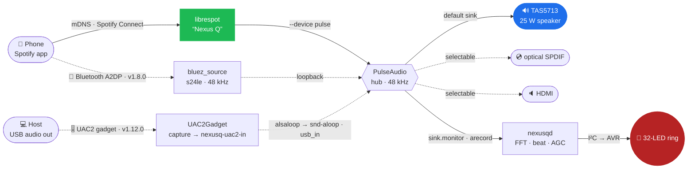
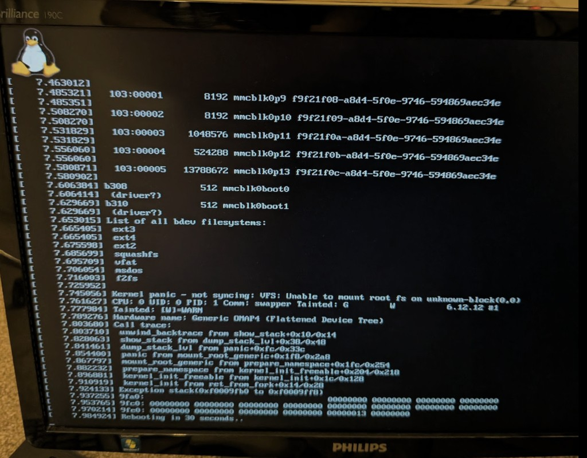

<div align="center">

# 🛸 Nexus Q&nbsp;Reloaded

### Google's glowing orb from 2012 — reborn on **mainline Linux**.

[](https://github.com/petronijus/nexusQ-reloaded/releases)
[](kernel/)
[](https://postmarketos.org)
[](#-hardware)
[](INSTALL.md)
[](LICENSE)

A discontinued Android curio with no apps, no recovery, and a sealed bootloader —
turned into a **dual-core postmarketOS media player** with Spotify&nbsp;Connect,
**AirPlay**, **Roon**, **Bluetooth A2DP**, **USB audio-in** (the orb as a USB DAC),
a beat-reactive **32-LED ring**, an **on-demand Wayland desktop** you can drive with
a **BT mouse&nbsp;+&nbsp;keyboard**, a 1.2&nbsp;GHz CPU, **NFC tap-to-send**, and a
**phone/desktop companion remote** that doubles as the screenless orb's
**Bluetooth settings panel** — and it **updates its own software over the air** and
**streams its health to Home Assistant over MQTT**.

[**Install**](INSTALL.md) · [**Releases**](https://github.com/petronijus/nexusQ-reloaded/releases) · [**Changelog**](CHANGELOG.md) · [**The story**](#-first-light)

</div>

---

## ✨ What it is

The **Nexus Q** (codename `steelhead`) was Google's mysterious 2012 media sphere:
a TI OMAP4460, a 25&nbsp;W amplifier, a ring of 32 RGB LEDs, and an Android build
that did almost nothing. Google cancelled it before it ever really shipped.

**Nexus Q Reloaded** throws away the Android stack and boots a **mainline Linux
6.18 LTS** kernel under **postmarketOS** — reverse-engineering the factory kernel
where mainline fell short, and bringing the orb back as something genuinely useful.

> It plays music. It glows in time. It runs `python3`, `ssh`, and a desktop. On a
> phone from before the original was even released.

---

## 🎯 What works

One line per subsystem — the full engineering story behind every row (root causes,
measurements, verification) lives in [CHANGELOG.md](CHANGELOG.md) and the dated
notes in [`docs/`](docs/).

| Subsystem | Status | Notes |
|---|:---:|---|
| 🐧 **Boot** — mainline 6.18 LTS + postmarketOS (systemd) | ✅ | daily-usable from a clean flash; boot log genuinely clean (`dmesg` err/warn empty). Moved 6.12.12 → 6.18.48 in v1.15.0; upstream-supported to Dec 2028 |
| ⚡ **Dual-core SMP** | ✅ | both Cortex-A9 cores online (`nproc=2`) · v1.2.0 |
| 🚄 **CPU freq scaling** 350 → **1200 MHz** | ✅ | DVFS since v1.4.0; an idle box sits at 350 MHz ~90 % of the time even with a USB host attached and not playing · device r90 (2026-08-30) |
| 🔊 **TAS5713 25 W speaker** | ✅ | audible since v1.6.13 (McBSP2 pinmux); playback crackle closed in v1.8.1 (sDMA priority + DPLL_ABE relock) |
| 🎵 **Spotify Connect** (librespot) | ✅ | advertises **"Nexus Q"**, one movable PulseAudio input · v1.6.15 |
| 🍏 **AirPlay** (shairport-sync) | ✅ | a PA input like librespot, avahi-advertised, ports pinned · v1.11.0 |
| 🎼 **Roon Bridge** (Roon Ready) | ✅ | glibc/Mono in a bwrap sandbox over a baked Debian base; validated against a real Core; default-OFF · v1.11.0 |
| 🎚 **USB Audio input** — the Q as a USB DAC | ✅ | the orb enumerates as a USB speaker (UAC2 gadget) and **mixes** into PA via a stable-clock snd-aloop hop, and costs nothing while the host is idle · v1.12.0 · device r90 |
| 🔊 **Audio output selection** | ✅ | speaker / optical / HDMI = the PA default sink, picked from the app · v1.7.0 |
| 🔴 **LED music visualizer** | ✅ | 5 visualisations + breathing themes, volume-independent AGC; stops rendering into a blanked ring on a silent tap since nexusqd r14 |
| 📱 **Companion app** + LAN control bridge | ✅ | Flutter remote **and** the screenless orb's BT settings panel; Android + iOS (first-time setup and self-update stay Android-only); MQTT health panel; own version track |
| 🔄 **OTA self-update** | ✅ | signed apk repo on GitHub Pages: daemons, the whole system, the **kernel** (health-gated trial slot) and an **A/B rootfs** — no cable, LED-narrated · v1.12.0+ |
| 📊 **MQTT health telemetry** | ✅ | `nexusq-mqtt` publishes retained health + HA discovery (19 entities); the app is the only credential provisioner (PROTOCOL §13) |
| 🖥 **HDMI desktop** (LXQt · Wayland) | ✅ | on demand from the app — the `user` linger keeps music playing when it stops · v1.10.0 |
| 📶 **WiFi** (BCM4330, 5 GHz) | ✅ | factory MAC pinned in DT; 5 GHz solid (`roamoff=1` + an auto-heal watchdog); ~34 Mbit/s is the 1×1 chip's ceiling — use ethernet for bulk |
| 🔵 **Bluetooth** + **A2DP audio** | ✅ | reliable since v1.8.0 (BT UART `max-speed`, patch 0040); Just-Works pairing via the permanent `nexusq-btagent` |
| 🖱 **BT pairing from the app** — both directions | ✅ | phone in (A2DP) *and* mouse/keyboard out; `bonded` (not `paired`) is the survives-a-reboot truth · v1.10.0 |
| 📲 **App-driven onboarding** (NFC → BT → WiFi) | ✅ | tap the dome → bonded encrypted RFCOMM → WiFi join; the pairing window fails closed · v1.9.0 |
| 🔐 **SSH** (ethernet / USB-gadget / WiFi) | ✅ | key-based root; RNDIS net + ACM console on the gadget · v1.6.6 |
| ⚡ **Fastboot over ssh** | ✅ | `systemctl reboot --reboot-argument=bootloader` → fastboot in ~15 s (patch 0044, stock SAR-RAM reboot reason) · v1.11.0 |
| 🐍 **python3** on-device | ✅ | flash-verified · v1.6.0 |
| 🌡 **TMP101 temperature sensor** | ✅ | |
| 📡 **NFC tap-to-send** (PN544) | ✅ | reverse-HCE — the phone hosts the card, the Q is the ISO-DEP reader (patch 0037) · v1.7.0 |
| 🔈 **HDMI audio** | 🟠 | needs a sink with audio EDID; untested against a real TV/AVR |
| 🌐 **Ethernet** (LAN9500A) | ✅ | cold-boot reliable since v1.6.8 (pinmux); the default deploy path (~80 Mbit/s); no MAC EEPROM → random MAC per boot |
| 💿 **TOSLINK / SPDIF** | ✅ | mainline McASP DIT, selectable output; PA pinned to 48 kHz so the DIT locks · v1.6.15 |
| 🎧 **TWL6040 headset codec** | ⚪ | unpopulated/unused on steelhead by design — the stock kernel never drove it |

---

## 🎵 The signal path

How a tap on your phone becomes sound **and** light — the heart of the v1.6.x work:


```mermaid
flowchart LR
    P([📱 Phone<br/>Spotify app]) -->|mDNS · Spotify Connect| L[librespot<br/>“Nexus Q”]
    P -.->|🔵 Bluetooth A2DP · v1.8.0| B[bluez_source<br/>s24le · 48 kHz]
    U([💻 Host<br/>USB audio out]) -.->|🎚 UAC2 gadget · v1.12.0| UC[UAC2Gadget<br/>capture → nexusq-uac2-in]
    L -->|--device pulse| PA{{PulseAudio<br/>hub · 48 kHz}}
    B -.->|loopback| PA
    UC -.->|alsaloop → snd-aloop · usb_in| PA
    PA -->|default sink| S([🔊 TAS5713<br/>25 W speaker])
    PA -.->|selectable| SP([💿 optical SPDIF])
    PA -.->|selectable| HD([🔈 HDMI])
    PA -->|sink.monitor · arecord| N[nexusqd<br/>FFT · beat · AGC]
    N -->|I²C → AVR| R(((🔴 32-LED ring)))

    style S fill:#1f6feb,stroke:#1f6feb,color:#fff
    style R fill:#b62324,stroke:#b62324,color:#fff
    style L fill:#1db954,stroke:#1db954,color:#fff
```

**PulseAudio is the hub**: every input (librespot, AirPlay, Roon, BT A2DP, USB) is
a PA client, and the active **output** — TAS5713 speaker, optical SPDIF, or HDMI —
is the PA default sink, chosen from the companion app. USB is the orb's only
no-solder digital *input* — every built-in port is an output. The LED daemon reads the
active sink's **monitor**, runs an FFT with an auto-gain stage, and animates the
ring — so the orb glows in time with whatever you're playing, at any volume.

The phone/desktop **companion app** auto-discovers the Q over mDNS and controls
volume, output, LED themes and visualisations, streaming-service toggles, pairing,
updates, and health — over the on-device `nexusq-control` bridge (TCP 45015,
line-JSON, [PROTOCOL.md](companion/PROTOCOL.md)). The Flutter app is installed on
the phone, **not** in the device image.

---

## 🚀 Quick start

Grab the [latest release](https://github.com/petronijus/nexusQ-reloaded/releases/latest), then:

```bash
# 1. Enter fastboot. On a booted v1.11.0+ device just:
#      ssh root@<Q> systemctl reboot --reboot-argument=bootloader   # → fastboot in ~15 s
#    First-time / unbooted / pre-v1.11.0: unplug power, cover the top mute-LED
#    sensor with your palm, plug power back in. The ring turns solid red.

# 2. Decompress the rootfs and flash
zstd -d nexusq-rootfs-v*-sparse.img.zst
fastboot flash boot      nexusq-boot-v*.img
fastboot -S 100M flash userdata nexusq-rootfs-v*-sparse.img   # -S chunking is REQUIRED

# 3. Power-cycle without covering the sensor. Tux → kernel → desktop.
```

Then open Spotify on the same WiFi and cast to **"Nexus Q"** 🎶. Full walkthrough in
**[INSTALL.md](INSTALL.md)**.

---

## 🧩 Hardware

| Component | Chip | Driver | Bus |
|---|---|---|---|
| SoC | TI **OMAP4460** (Cortex-A9 ×2) | `omap4` | — |
| Audio amp | TI **TAS5713** 25 W Class-D | `snd-soc-tas571x` | McBSP2 / I²C4 |
| Audio codec | — (TWL6040 pad unpopulated/unused; stock never drove it) | none — removed from DTS/defconfig | — |
| WiFi | Broadcom **BCM4330** | `brcmfmac` | SDIO / MMC5 |
| Bluetooth | Broadcom BCM4330 | `hci_bcm` | UART2 |
| NFC | NXP PN544 | `pn544_i2c` | I²C3 |
| Ethernet | SMSC LAN9500A | `smsc95xx` | USB EHCI |
| HDMI | OMAP4 DSS + TPD12S015A | `omapdrm` | DSS |
| LED ring | AVR MCU (32 RGB) | `leds-steelhead-avr` | I²C2 |
| PMIC | TI TWL6030 | `twl-core` | I²C1 |

---

## 🛠 Build from source

One command, fully dockerized (pmbootstrap under the hood):

```bash
./docker-build.sh        # → output/boot.img + output/google-steelhead.img
```

It builds the kernel (mainline 6.18.48 + **44 patches** in `kernel/patches/`), the
device daemons (`nexusqd` · `nexusq-control` ·
`nexusq-btagent` · `nexusq-setupd` · `nexusq-mqtt`), and a full systemd rootfs, then repacks a
ramdisk-less boot image and verifies the result by **mounting** it. Build notes and
the hard-won gotchas live in `HANDOFF.md`. (⚠️ The daemon build **phase order is
load-bearing**: `nexusq-btagent` must build *before* `nexusq-setupd`, which depends
on it — the reverse order fails every clean build on checksums.)

```
kernel/      dts · defconfig · 46 mainline patches (the DTS ships VIA the patches — edit a patch, not just kernel/dts/)
pmos/        device-google-steelhead · linux-google-steelhead · firmware · nexusqd · nexusq-control · nexusq-btagent · nexusq-setupd · nexusq-mqtt · speexdsp · ota-packages.list + the fleet signing key
userspace/   nexusqd (LED-ring daemon) · nexusq-control (LAN bridge) · nexusq-btagent (BT pairing agent) · nexusq-setupd (BT WiFi provisioning) · nexusq-mqtt (MQTT health telemetry)
companion/   Flutter companion app + PROTOCOL.md (built on the phone, not in the image)
reverse-eng/ ground truth extracted from the factory kernel
scripts/     diagnostics (nq-healthd, nq-collect, …)
docs/        dated engineering record
raw2simg.py  byte-exact all-RAW Android-sparse converter
```

---

## 🗺 Milestones

One line per milestone; the full story of each is in [CHANGELOG.md](CHANGELOG.md).

```
0.1.0 ── first full boot, HDMI, WiFi, LED ring                                     2026-06-10
1.1.0 ── ethernet alive                                                            2026-06-22
1.2.0 ── ✦ dual-core SMP                                                           2026-06-23
1.3.0 ── ethernet hardened                                                         2026-06-24
1.4.0 ── ✦ cpufreq DVFS → 1.2 GHz                                                  2026-06-26
1.5.0 ── first full host-built rootfs                                              2026-06-27
1.6.0 ── ✦ python3 on-device (the flash-bug saga)                                  2026-06-28
1.6.1 ── ✦ TAS5713 audio fixed + Spotify Connect baked in                          2026-06-29
1.6.2 ── ✦ LED music visualizer reacts to playback                                 2026-06-30
1.6.3 ── ✦ companion app + LAN control bridge                                      2026-06-30
1.6.5 ── ✦ breathing themes + 5 visualisations · LED keepalive · app over WiFi     2026-07-01
1.6.6 ── ✦ NFC fixed (pinmux) · boot-error cleanup · factory MAC on air            2026-07-04
1.6.8 ── ✦ ethernet works from cold — unmuxed NENABLE pad                          2026-07-06
1.6.10 ─ ✦ boot log GENUINELY clean — dmesg err/warn empty                         2026-07-06
1.6.13 ─ ✦ TAS5713 speaker finally AUDIBLE (McBSP2 pinmux) + SPDIF bring-up        2026-07-07
1.6.15 ─ ✦ PA-centric audio: multi-input → app-selectable output · LED AGC         2026-07-07
1.7.0 ── ✦ NFC tap-to-send (reverse-HCE) · companion auto-reconnect                2026-07-08
1.8.0 ── ✦ Bluetooth A2DP reliable (BT UART max-speed)                             2026-07-10
1.8.1 ── ✦ playback crackle CLOSED (sDMA priority + DPLL_ABE relock)               2026-07-12
1.8.2 ── ✦ idle power — conservative governor, idle settles at 350 MHz             2026-07-13
1.9.0 ── ✦ app-driven onboarding (NFC → bonded BT → WiFi), fails closed            2026-07-15
1.10.0 ─ ✦ BT pairing from the app, BOTH directions · HDMI desktop on demand       2026-07-15
1.10.1 ─ ✦ bug-fix round: DT WiFi MAC · btagent fd leak · app debug mode           2026-07-16
1.11.0 ─ ✦ streaming services: AirPlay · Roon · Settings/toggles · fastboot-over-ssh   2026-07-31
(dev) ── ✦ USB Audio input — the Q as a toggleable USB DAC (UAC2 gadget)           2026-08-02
(dev) ── ✦ device OTA — self-update from a signed GitHub-Pages apk repo            2026-08-02
(dev) ── ✦ full-system OTA + glibc-rt split (config apk 191 MB → 58 KB)            2026-08-02
(dev) ── ✦ USB-audio delay/heat fixed — bounded direct alsaloop bridge             2026-08-09
(dev) ── ✦ MQTT health telemetry → Home Assistant + app health panel               2026-08-10
1.12.0 ─ ✦ OTA everywhere · MQTT telemetry · USB audio mixes in PA · iOS app       2026-08-12
(dev) ── ✦ idle diet — healthd + nexusqd rewrites; idle busy 18.2 → ~7.7 %         2026-08-13
(dev) ── ✦ idle OPP root-caused → governor tuned: 91 % @ 350 MHz verified          2026-08-16
(dev) ── ✦ USB Audio pinned the clock at 1200 MHz → one governor knob, 84→68 °C   2026-08-24
(dev) ── ✦ speexdsp rebuilt with NEON — resampling 1.34-2.86x faster              2026-08-24
(dev) ── ✦ kernel OTA (trial slot) + A/B rootfs + rescue initramfs · healthd in C  2026-08-18…21
(dev) ── ✦ DFS ch100 mystery solved · healthd rotation leak (r80) · OTA-repo dep rule   2026-08-23
1.13.0 ─ ✦ hardware EQ (7-band TAS5713 biquads) · Roon idle guard · idle power 20× down   2026-08-28
1.14.0 ─ ✦ rename the Q from the app · per-unit Bluetooth/WiFi identity            2026-08-29
1.14.1 ─ ✦ a wedged USB-audio bridge that cooked the box for 28 h — closed         2026-08-30
1.14.2 ─ ✦ Spotify Connect survives a DHCP move · two release gates stop lying     2026-08-30   ← latest tag
(dev) ── ✦ a release publishes BOTH tracks now — image + OTA repo, gated on parity   2026-08-30
(dev) ── ✦ USB-audio park reads the gadget's own flag — 350 MHz 85.4 → 90.4 %      2026-08-30
```

<sub>(v1.7.4 was an unusable crackle-bake artifact — never shipped; v1.8.0 is its working successor.)</sub>

---

## 📸 First light

<div align="center">



<sub><i>Where it started: Tux and a mainline 6.12 kernel reaching the Nexus Q's HDMI output<br>(an early 2026 milestone — the root filesystem came a few commits later).</i></sub>

</div>

---

## 📜 License

[**GPL-2.0**](LICENSE) — this repository carries Linux kernel patches, a device tree,
and a defconfig, all derivative works of the Linux kernel (GPLv2).

<div align="center">
<sub>Built with stubbornness for a sphere that deserved better. 🛸</sub>
</div>
