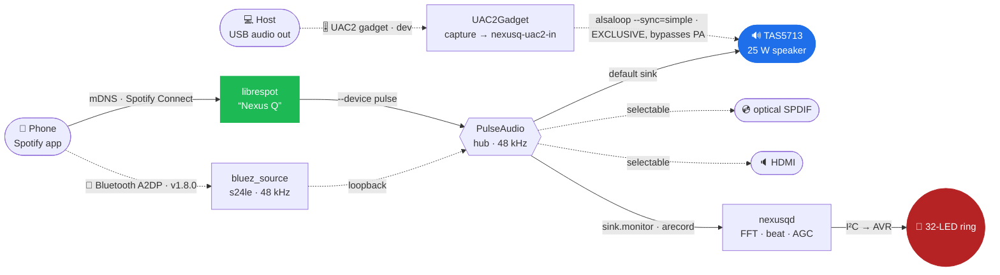

<div align="center">

# 🛸 Nexus Q&nbsp;Reloaded

### Google's glowing orb from 2012 — reborn on **mainline Linux**.

[](https://github.com/petronijus/nexusQ-reloaded/releases)
[](kernel/)
[](https://postmarketos.org)
[](#-hardware)
[](INSTALL.md)
[](LICENSE)

A discontinued Android curio with no apps, no recovery, and a sealed bootloader —
turned into a **dual-core postmarketOS media player** with Spotify&nbsp;Connect,
**AirPlay**, **Roon**, **Bluetooth A2DP**, **USB audio-in** (the orb as a USB DAC),
a beat-reactive **32-LED ring**, an **on-demand Wayland desktop** you can drive with
a **BT mouse&nbsp;+&nbsp;keyboard**, a 1.2&nbsp;GHz CPU, **NFC tap-to-send**, and a
**phone/desktop companion remote** that doubles as the screenless orb's
**Bluetooth settings panel** — and it **updates its own software over the air** and
**streams its health to Home Assistant over MQTT**.

[**Install**](INSTALL.md) · [**Releases**](https://github.com/petronijus/nexusQ-reloaded/releases) · [**Changelog**](CHANGELOG.md) · [**The story**](#-first-light)

</div>

---

## ✨ What it is

The **Nexus Q** (codename `steelhead`) was Google's mysterious 2012 media sphere:
a TI OMAP4460, a 25&nbsp;W amplifier, a ring of 32 RGB LEDs, and an Android build
that did almost nothing. Google cancelled it before it ever really shipped.

**Nexus Q Reloaded** throws away the Android stack and boots a **mainline Linux
6.12 LTS** kernel under **postmarketOS** — reverse-engineering the factory kernel
where mainline fell short, and bringing the orb back as something genuinely useful.

> It plays music. It glows in time. It runs `python3`, `ssh`, and a desktop. On a
> phone from before the original was even released.

---

## 🎯 What works

| Subsystem | Status | Notes |
|---|:---:|---|
| 🐧 **Boot** — mainline 6.12 + postmarketOS (systemd) | ✅ | daily-usable from a clean flash · **genuinely clean boot log** — 0 failed units, `dmesg` err/warn EMPTY, and `journalctl -b -p warning` down to only 4 documented-external lines (all ~15 v1.6.9 residual err/warn lines root-caused + fixed · was 3 externals v1.6.10–v1.8.1; a 4th — a one-shot NM vendored-libsystemd assert at the RTC→NTP clock jump — was dispositioned 2026-07-13) · v1.6.10 |
| ⚡ **Dual-core SMP** | ✅ | both Cortex-A9 cores online (`nproc=2`) · since v1.2.0 |
| 🚄 **CPU freq scaling** 350 → **1200 MHz** | ✅ | DVFS · v1.4.0 · governor **`conservative`** since **v1.8.2** — a measured 2026-07-13 idle study showed `ondemand` kept 74 % of idle at ≥700 MHz on microburst wakeups (~1000/s); `conservative` won the A/B/C test and idle now **settles at 350 MHz** (56.7 % residency, 4.25 trans/s). History: `conservative` v1.5.0–v1.6.5 → `ondemand` v1.6.6–v1.8.1 → `conservative` v1.8.2 (this time measurement-backed) |
| 🔊 **TAS5713 25 W speaker** | ✅ | **audible since v1.6.13** (kernel r36). The software pipeline (driver/PCM/softvol, correct pitch — 2× clock bug) landed v1.6.1, but the physical amp was **silent through every earlier release**: `mcbsp2_pins` muxed the wrong balls (`abe_dmic_*`), so the McBSP2 I2S clock/data/frame never reached the amp (`aplay` rc=0, nothing driven). Root-caused + fixed in DTS 2026-07-07 (stock pads `0x0f6/0x0fa/0x0fc` MUX_MODE0) → user-confirmed audible. Now one selectable PulseAudio output (**v1.6.15**, shipped in v1.7.0). The residual playback **crackle is CLOSED 2026-07-12 — it was TWO independent faults, both fixed** (hardware-verified, user-confirmed perfectly clean playback): (a) load-correlated bus/DMA contention → kernel **r41** patch **0041** (sDMA `CCR_READ_PRIORITY` on the cyclic audio channel + GCR `HI_THREAD_RESERVED=1`; verified `GCR=0x00011010`, ch20 CCR bit6=1); (b) a metronomic ~1/s click from **two free-running crystals** — mainline reparented the DPLL_ABE reference to sys_32k while the TAS5713 MCLK sat on the 38.4 MHz crystal (~21 ppm ≈ 1 sample slip/s @ 48 kHz) → kernel **r42** patch **0042** relocks DPLL_ABE from `sys_clkin` at exactly 98.304 MHz, the stock topology the bootloader sets and our port was undoing. See `docs/2026-07-12-audio-crackle-closed-sdma-priority-and-dpll-abe.md` (+ the 07-08/07-09 diagnosis notes) |
| 🎵 **Spotify Connect** (librespot) | ✅ | advertises **"Nexus Q"**, streams over 5 GHz · v1.6.1 · **now a PulseAudio input** (systemd user unit → `--device pulse`), one movable PA sink-input · v1.6.15 |
| 🍏 **AirPlay** (shairport-sync) | ✅ | a PulseAudio input like librespot (user unit, `alsa`→`pulse`), advertises the onboarding name via avahi (`_raop._tcp`), ports pinned (RTSP 5000 + UDP 6001-6010, `61_airplay.nft`) · **user-tested playing 2026-07-17** · device **r50** · **shipped in v1.11.0** |
| 🎼 **Roon Bridge** (Roon Ready endpoint) | ✅ | Roon's glibc/Mono binaries can't run on musl (gcompat segfaults them), so the Bridge runs in a **bwrap sandbox over a baked Debian-armhf glibc base** (`/opt/glibc-rt`) — only the base is baked, RoonBridge is lazy-fetched on first use and **self-updates**. Audio via a dedicated 2nd `snd-aloop` card → PA `roon_in` → default sink, so it follows the output selector like every input. **Validated end-to-end against a real ROCK Core 2026-07-17** (discovery, enable, playback). **Default-OFF** user unit — enabled on demand (`systemctl --user enable --now roon`), the resource policy. Toggled from the app's per-service switches. See `docs/2026-07-17-roon-bring-up.md` · device **r55** · **shipped in v1.11.0**. Tidal deferred (grey-area binary) |
| 🎚 **USB Audio input** — the Q as a USB DAC | ✅ | **the Q takes audio IN over USB, no solder / no Bluetooth** (post-v1.11.0 dev, device **r65** · kernel **r46** · `nexusq-control` r16 · app 1.7.0+16). The Q has **no optical/HDMI/line input** — all its ports are OUTPUTS (verified: DTS `mcasp0` is DIT/TX → `spdif-dit`, and the OMAP4 HDMI is DSS output-only via TPD12S015A; TI docs + teardown), so USB is the only no-solder digital input. Plug a computer/phone into the micro-USB → the Q enumerates as a **USB speaker** ("Nexus Q"); kernel `CONFIG_USB_CONFIGFS_F_UAC2` (module `usb_f_uac2`) + a `uac2.0` function on the composite gadget (`c_chmask=3`/`c_srate=48000`/`c_ssize=2`/`p_chmask=0` — a *speaker*, not a mic) surface the host audio as the `UAC2Gadget` ALSA capture card, and `nexusq-uac2-in` bridges it **straight to the TAS5713 amp** with `alsaloop --sync=simple` — **no PulseAudio in the audio path** (rewritten 2026-08-09, was a PA `module-loopback` bridge). A **4th per-service app switch** ("USB Audio", default-OFF). A TV's optical/HDMI can't feed it (that needs a receiver-chip mod); a computer/phone with USB-audio out can. ✅ **The multi-minute playback delay + idle CPU/heat are FIXED (2026-08-09, device r65; committed `2dccd3a`, push + OTA pending)** — the old PA bridge's `module-alsa-source` reported a bogus uptime-growing latency that poisoned `module-loopback`'s resampler (backlog grew to minutes) and its never-corked sink-input kept the amp/DAC/DMA running 24/7 (~15–20 % CPU + heat in silence). The direct `alsaloop` bridge rate-matches from the **real hardware pointers** with **bounded** buffers so the delay can't run away; measured live: lip-sync correct (Petr-confirmed), alsaloop **~0 %** CPU (was 15–20 %), die **93 °C → 76–79 °C**. `--sync=simple` (not `samplerate`: the device's `alsa-utils` has no libsamplerate). **Trade-off:** USB audio is now **EXCLUSIVE** — `nexusq-uac2-in` suspends PA's tas5713 sink (Spotify/AirPlay/Roon are paused while it's on) and drives the TAS5713 hardware mixer directly (safe `NQ_UAC2_VOL` 10 % start; `nq-vol` steers `amixer` Master/Speaker so the ring still works); on stop the amp is handed back to PA. Known minor: the LED music visualizer taps the PA source, so the ring won't pulse to USB-audio playback. See `docs/2026-08-02-usb-audio-input.md` + `docs/2026-08-08-usb-audio-playback-delay-and-ota-publish.md` |
| 🔊 **Audio output selection** (speaker / optical / HDMI) | ✅ | **v1.6.15** (shipped in v1.7.0): PulseAudio is the hub, the active output = the PA default sink, picked from the companion app (`listOutputs`/`setOutput` → `pactl set-default-sink` + move all sink-inputs + class-D amp safety toggle). Input-agnostic + future-proof (BT-A2DP / Tidal / casting can join as further PA inputs) |
| 🔴 **LED music visualizer** | ✅ | the ring dances to the beat · v1.6.2 · **5 selectable visualisations** + breathing color themes · idle-keepalive (no more dark-after-idle AVR starvation) · v1.6.5 · **volume-independent** — re-tapped to the active output's PA monitor + an AGC (auto-gain) so it reacts to the music at any listening volume, no low-volume flicker · v1.6.15 · **tap now gated on playback** so the amp sink suspends when idle (idle CPU ~7 % → ~1 %) · v1.7.1 |
| 📱 **Companion app** + LAN control bridge | ✅ | Flutter remote → `nexusq-control` (TCP 45015, mDNS): volume · breathing LED theme + brightness · **visualisation picker** · now-playing · v1.6.3 · reachable over WiFi · v1.6.5 · **output selector** (Holo-dark segmented control) + volume/mute now act on the active PA sink · v1.6.15 · **NFC tap-to-send receiver** (HCE — the Q taps a message onto the phone, shown as a SnackBar) + **auto-reconnect on resume/drop** (no more app-kill after backgrounding) · v1.7.0 · **two-way volume sync** — the app slider now tracks the **physical dome dial** and the LXQt applet (bridge `pactl subscribe` → `volumeChanged`) · v1.7.3 (verified live, not yet in a flashed image) · **Devices screen** (app **1.2.0+7**, device **v1.10.0**): *Pair a phone* / *Add a mouse or keyboard* / paired list with *Forget* / **HDMI desktop toggle**, from the home app bar. ⚠️ **no design review yet** — tested functionally only · **Debug mode** (Devices → Developer, app **1.3.1+9**): an always-on in-app connection log (method names only, never params) — it found the v1.10.1 btagent fd-leak on the first try. The app is versioned on its **own independent track**, deliberately NOT aligned to image releases · **runs on iOS since 2026-08-03** (verified on the iPhone 17 simulator, iOS 26.5): discovery via **native Bonjour** (NWBrowser — iOS forbids raw-socket mDNS without a restricted entitlement); first-time BT setup + self-update stay **Android-only** (no public iOS RFCOMM API; apk hand-off) — once the Q is on WiFi, iOS controls it fully. See `docs/2026-08-03-ios-companion-port.md` · **Health panel** (app **1.12.0+31**, 2026-08-10 — apk released as `app-v1.12.0`, OTA-manifest push pending): Settings → *Device health* — live MQTT-fed vitals/OPP-residency/service/WiFi view with a manual "Connect to MQTT" dialog (creds in the platform secure store; reads the broker, no protocol change) |
| 🔄 **OTA self-update** (full system + app) | ✅ | **the Q updates its own software over the air — no reflash, no adb** (post-v1.11.0 dev). A **signed apk repo on GitHub Pages** (`petronijus.github.io/nexusQ-reloaded/nexusq`, gh-pages) hosts the packages; the device already trusts the `pmos@local` build key baked in `/etc/apk/keys`, so `apk` installs our signed packages straight from it. **Two tracks, two Settings items:** **App update** (the phone app + the four device daemons `nexusq-control`/`nexusqd`/`nexusq-btagent`/`nexusq-setupd`, versioned together as the companion system — `checkNexusUpdate`/`installNexusUpdate`, `nexusq-control` **r25**), and **System** — the whole-appliance *apt upgrade* (`checkSystemUpdate`/`installSystemUpdate`: `apk upgrade --available` for **every** package, base musl/systemd/python + our config + daemons, **minus the kernel** — proven live upgrading systemd 261.1→261.2, reboots when base libc/init churns). **The glibc-rt split** (new aport `nexusq-glibc-rt`, `device-google-steelhead` r62) dropped the device-config apk from ~191 MB to 58 KB so the config now ships over OTA too (the ~182 MB glibc-rt base + the kernel stay flash-only; adopting the split needs **one** reflash). **LED-narrated** (nexusqd **r11**): mute-LED **amber** blink = "app update available" (ring stays on your theme); the daemon install shows a **determinate ring progress bar**, the system install an **indeterminate spinner** (slow/unknown length), a **green** flash on success. **Proven end-to-end live 2026-08-02** — daemons r10/r16→r11/r19 from the app, no cable. Companion app **1.11.0** (own track). ✅ **Fixed (2026-08-08, Option A): the System track used to report "system update failed" even though the packages installed** — the `postmarketos-mkinitfs`/`boot-deploy` trigger failed (`No kernel found in /boot`, empty plain dir on this ramdisk-less device) and left a persistent pending trigger. Fixed by restoring the kernel payload (vmlinuz + dtbs) to `/boot` so boot-deploy succeeds (it never flashes a partition — `deviceinfo_flash_kernel_on_update` is unset); live device cleaned + `docker-build.sh` now ships a populated `/boot`. Kernel OTA itself is still Phase-2. See `docs/2026-08-08-system-ota-mkinitfs-trigger-failure.md`. See `docs/2026-08-02-full-system-ota-and-glibc-rt-split.md` + `docs/2026-08-02-device-ota-and-wifi-nogw-heal.md` + PROTOCOL §12 |
| 📊 **MQTT health telemetry** → Home Assistant + app | ✅ | **dev, 2026-08-10 (uncommitted; device-OTA publish + app OTA-manifest push pending)** — a new pure-Python-stdlib daemon (**`nexusq-mqtt`** 0.1.0-r0, noarch; MQTT 3.1.1 subset: CONNECT+auth+LWT, QoS0+retain, PINGREQ dead-link detection, reconnect+backoff) publishes the Q's health every 30 s: retained `nexusq/health/state` JSON + `nexusq/status` online/offline LWT + retained **Home Assistant MQTT discovery** (12 sensors + 6 binary_sensors — die temp, CPU freq/governor, per-OPP residency shares, load, memory, WiFi RSSI, volume, uptime; Spotify/AirPlay/Roon/USB-Audio running, LED-daemon + health-sampler problem flags). Data = `nq-healthd`'s `health.jsonl` tail (only when fresh ≤60 s) + the daemon's own sampling (`time_in_state` OPP deltas, `iw` RSSI, the mixer that currently owns the output, cgroup service states). **Deployed live 2026-08-10: 18 entities in HA with real values.** Broker creds (`/etc/nexusq/mqtt.json`, 0600) are a per-home secret — **never baked into the public image**; an unprovisioned device skips the service cleanly. The companion app (**1.12.0**) reads the same feed: Settings → **"Device health"** panel with a manual "Connect to MQTT" dialog (creds in the platform secure store). Device r67 (`depends += nexusq-mqtt`). See `docs/2026-08-10-mqtt-health-telemetry.md` |
| 🖥 **HDMI desktop** (LXQt · Wayland) · **on demand** | ✅ | **toggle-able from the app since v1.10.0** (`setDesktop`/`getDesktop` → `tinydm.service`) — the desktop idles the GPU/display path and heats the sphere, so it is on-request. The **`user` linger is load-bearing** (baked in device **r48**): PA + librespot are user units under `user@10000.service`, the desktop is `tinydm` → labwc in `session-c1.scope` — **without linger the user manager exists only because of the graphical session, so stopping the desktop would kill the music**. Verified: with linger, `systemctl stop tinydm` leaves pulseaudio + librespot active, both sinks present. Pair a keyboard + mouse (row above), switch the desktop on → the appliance is a computer. · labwc + Pixman renderer · **desktop audio sink fixed v1.6.12** (the red-cross no-sink tray icon: PA now starts via a native systemd USER unit — Alpine ships none and the XDG autostart never fires under systemd+Wayland — and the sole sink is the TAS5713 speaker) |
| 📶 **WiFi** (BCM4330, 5 GHz) | ✅ | NetworkManager, factory MAC `f8:8f:ca:20:48:e1` **pinned in the DTS since v1.10.1** (kernel patch 0043 — `local-mac-address`, mirrors the BT node; `ethtool -P wlan0` reports it as PERMANENT, so every profile incl. the onboarding one gets it — the old NM `cloned-mac-address` pin only reached the baked profile, and ≤v1.10.0 fell back to the chip OTP MAC `14:7d:c5:3a:35:b5`). The router can still reassign the DHCP lease (seen 2026-07-12): find the device by hostname `steelhead`/MAC, don't hardcode the IP. **Characterized 2026-07-07: 5 GHz is healthy — NOT flaky** (−48 dBm, 0 discarded/retry pkts, 2.6 ms jitter, 0 % loss); bulk **~34 Mbit/s is a hardware ceiling** of the 2010-era 1×1 802.11n BCM4330 (not a bug — same cipher does ~80 over ethernet, so WiFi is the limit; ~100× the appliance's need). Use **ethernet for bulk**. An intermittent **5 GHz TX-dead wedge** on long uptimes (associated but 0 traffic, `brcmf_escan_timeout` flood) was the BCM4330 failing in-firmware background *roam* scans — fixed by **`brcmfmac roamoff=1`** (device r56; the Q never roams, it's bolted to one AP). An on-device **`nexusq-wifi-watchdog`** (device r57) pings the gateway every 30 s and auto-bounces `wlan0` if it wedges, logging health to `/var/log/nq-health/wifi-watchdog.jsonl`; it proved the fix with a **29 h clean run (2026-08-01)** — the earlier "5 GHz TX degrades, open" item is **RESOLVED**. A second wedge shape — **associated but no default route** (NM stuck in "getting IP configuration", DHCP got no lease, so the iface has an IP but no route and the LAN is unreachable) — is now healed too (device **r61**): the `nogw` state counts as a bad check and triggers the same disconnect/connect heal (was `fails=0` → never healed the exact case it was built for); live-caught 2026-08-02 |
| 🔵 **Bluetooth** + **A2DP audio** (BCM4330) | ✅ | **A2DP sink reliable since v1.8.0** — pair a phone and stream to the Q (`phone → BT → PulseAudio bluez_source s24le/48 kHz → TAS5713`). Root cause of every past "won't stay connected / phantom Connected / corrupt-burst audio" was a **missing BT HCI UART `max-speed`**: the BCM4330 HCI runs over UART2 and `hci_bcm` left `oper_speed=0`, never syncing the host UART to the firmware baud → `hci0: Frame reassembly failed (-84)` (EILSEQ) + tx timeouts. Kernel **patch 0040** sets `max-speed = <3000000>` (stock ran 3 Mbaud); verified live — reassembly failures 0 (was 26+), controller addr correct. (NOT coexistence, NOT HFP/SCO — both earlier wrong guesses.) **Pairing is `NoInputNoOutput` Just-Works via `nexusq-btagent`** (the Q's single **permanent** agent — nothing attached to it can answer a prompt; bonds are marked `Trusted`, and the ring spins blue **⇔** the Q is pairable). ⚠️ `blueman-applet` must stay out of the session: its **DisplayYesNo** agent forces SSP into **Numeric Comparison** → an unanswerable HDMI dialog → every bond times out (root-caused 2026-07-15; suppressed since device r47 — the *package* stays). Per-device **BD_ADDR** `F8:8F:CA:20:49:E5` since v1.6.10 (DTS `local-bd-address` + btbcm patch 0036) |
| 🖱 **BT pairing from the app** — **both directions** | ✅ | **v1.10.0** — the Q has no screen and no input device, so **the app IS the Q's Bluetooth settings panel**; there is no other way to pair anything to it. **Inbound**: a phone pairs for music (A2DP). **Outbound**: the Q *scans for and pairs* a **mouse / keyboard** — a different flow, not a variant (a mouse never connects TO us; we must discover it and call `Pair()` on it). Hardware-verified 2026-07-15: `pairBtDevice` → `{"paired":true,"bonded":true,"connected":true}`, 3 key sections on disk, kernel created `MX Master 4 Mouse` on `/dev/input/…` via **uhid**; a real BLE keyboard (MX Keys) completes **Just Works** against our `NoInputNoOutput` agent with **no typed passkey**. ⚠️ **`bonded`, not `paired`, is the honest answer to "will this survive a reboot?"** — `paired` alone LIES. Root cause this release is built on: v1.9.0's **`Pairable == Discoverable` invariant was keyed on the WRONG property** and silently broke OUTBOUND bonding (`Pairable: no` → pair "succeeds", **no keys stored**, gone on restart; `Pairable: yes` → `[PeripheralLongTermKey]` + `[IdentityResolvingKey]` on disk, survives). Chain measured from `bluetoothd -d`: the LTK **arrives**, but bluez only persists a key the kernel marked `store_hint`, which needs the SMP **bonding bit**, which our side only sets under **`HCI_BONDABLE`** = `Adapter1.Pairable`. Now: **ring ⇔ `Pairable`**, off at rest, and an outbound pair **opens a window like everything else**. See `docs/2026-07-15-step2-bt-pairing-implemented.md` + PROTOCOL §9 |
| 📲 **App-driven onboarding** (NFC tap → BT → WiFi) | ✅ | **works end-to-end from a fresh flash · v1.9.0** — hardware-accepted 2026-07-15. Tap the phone on the dome → bonded, **encrypted** BT RFCOMM (`nexusq-setupd`, `RequireAuthentication=True` — the WiFi PSK never crosses the air in cleartext) → WiFi join → name/room/theme → outro, with the original stock imagery. Final acceptance on a fresh `v1.9.0-rc5` flash: tap delivered → **bond first try (0 failed attempts)** → RFCOMM → WiFi joined → `finishSetup` → pairing window auto-closes (PSK: 0 log lines); wrong password → ring turns red. The pairing window **fails CLOSED** (a transient NetworkManager wobble can no longer drop a provisioned device into a discoverable+pairable setup mode). `startSetupMode` re-provisioning tested + passing. ⚠️ **Known-open**: a pairing flake seen once (2 failed attempts, then 3 runs first-try — **NOT root-caused**); a fresh **dev** image does **not** arm setup mode (it bakes a WiFi profile — `PUBLIC_RELEASE=1` images do onboard). See `docs/2026-07-15-bt-onboarding-root-caused-blueman-agent-and-bond-first.md` |
| 🔐 **SSH** (USB-gadget + WiFi) | ✅ | RNDIS net `172.16.42.1` + ACM console. On v1.6.5 only `user@` works; key-based `root@` is baked in + verified 2026-07-03 (ships in v1.6.6) |
| ⚡ **Fastboot over ssh** (no power-cycle) | ✅ | **v1.11.0** — `systemctl reboot --reboot-argument=bootloader` drops the device into fastboot in ~15 s (`fastboot reboot` returns to Linux, no loop). Kernel **patch 0044** reimplements the stock reboot-reason write mainline had left as a TODO (`omap44xx_restart()` dropped the command): the string goes to **SAR RAM `0x4A326A0C`** which survives the warm reset, and the stock u-boot reads it (`"bootloader"`/`"recovery"`/…). ⚠️ must be `systemctl` — busybox `reboot` doesn't forward the arg. Saves the mains power-cycle that stresses the ~35 W SMPS + slow-blow fuse. See `docs/2026-07-30-fastboot-over-ssh-and-mains-fuse-repair.md` |
| 🐍 **python3** on-device | ✅ | flash-verified · v1.6.0 |
| 🌡 **TMP101 temperature sensor** | ✅ | |
| 📡 **NFC tap-to-send** (PN544) | ✅ | **tap-to-send shipped v1.7.0** (2026-07-08, verified on device): tap a phone on the dome → the Q pushes a short text over NFC, shown in the companion app. **Reverse-HCE** — the PN544 can't host-card-emulate (no SE) and Android Beam is gone, so the phone runs the HCE service and the **Q is the ISO-DEP reader** (`nexusq-nfc-send` daemon, AID `F0010203040506`). Key enabler: kernel **patch 0037** RATS-activates any ISO-DEP target (was DESFire-only), so a modern HCE phone (SAK 0x20) is finally reachable. The chip itself was **fixed 2026-07-03** (v1.6.6) — the DTS had muxed the wrong pads (dpm_emu debug pads instead of `usbb2_ulpitll_dat1/2/3`), found via a stock RAM-boot probe. See `docs/2026-07-08-nfc-tap-to-send-reverse-hce.md` |
| 🔈 **HDMI audio** | 🟠 | needs a sink with audio EDID (the card is a dummy-DAI — PA ignores it via a `PULSE_IGNORE` udev rule, so no more boot-log noise · v1.6.9); joins the output selector as `hdmi` once that rule is lifted against a real audio sink (TV/AVR) — UNTESTED |
| 🌐 **Ethernet** (LAN9500A) | ✅ | **works from a cold boot — task #17 fully closed** (gold-validated: clean flash + true cold power-cycle → `eth0` 100Mbps/Full, 0 failed units). The "enumeration intermittency" was a **pinmux miss**: `gpio_1` NENABLE (the LAN9500A power-enable) sat on an **unmuxed pad** (`kpd_col2` @ padconf `0x186`) so it never powered the chip — the healthy USB3320 PHY masked it, and the earlier "3/3 vs 0/3 boots" was stock priming, not a race. Fixed in kernel `#33` (DTS pad mux); the 2500ms "settle" it superseded was a false positive · **v1.6.8**. NM layer resolved 2026-07-04 (baked `eth-lan` DHCP + `eth-direct` static `ssh root@10.42.0.2`). **Now the DEFAULT deploy/control path** (measured 2026-07-07: ~80 Mbit/s, 0.62 ms — faster + more stable than WiFi/USB-gadget, fixed IP; the direct-cable static profile auto-comes-up since device r29 · v1.6.12). Chip has no MAC EEPROM → random MAC/lease per boot on a LAN |
| 💿 **TOSLINK / SPDIF** | ✅ | **brought up in v1.6.13** — no C driver (mainline `davinci-mcasp` DIT/IEC958): defconfig `SND_SOC_DAVINCI_MCASP=m`+`SND_SOC_SPDIF=m`, DTS `&mcasp0` + `mcasp_spdif_pins` (`0x0f8` MUX_MODE2, AXR0) + `sound_spdif` card. Probe `-EINVAL` fixed via `format="i2s"`+mcasp master. A selectable PA output ("Optický výstup") since **v1.6.15**; PA pinned to 48 kHz (`50-nexusq-48k.conf`) so the DIT locks (44.1 kHz → "off by 88435 PPM"). Both PA sinks report 48000 Hz on fresh boot |
| 🎧 **TWL6040 headset codec** | ⚪ | not populated/unused on steelhead — the stock kernel never drove it (verified 2026-07-03); no headset path **by design** (was wrongly called "dead hardware") |

<sub>Full per-milestone detail in [CHANGELOG.md](CHANGELOG.md) · hardware map &amp; roadmap in [PLAN.md](PLAN.md).</sub>

---

## 🎵 The signal path

How a tap on your phone becomes sound **and** light — the heart of the v1.6.x work:


```mermaid
flowchart LR
    P([📱 Phone<br/>Spotify app]) -->|mDNS · Spotify Connect| L[librespot<br/>“Nexus Q”]
    P -.->|🔵 Bluetooth A2DP · v1.8.0| B[bluez_source<br/>s24le · 48 kHz]
    U([💻 Host<br/>USB audio out]) -.->|🎚 UAC2 gadget · dev| UC[UAC2Gadget<br/>capture → nexusq-uac2-in]
    L -->|--device pulse| PA{{PulseAudio<br/>hub · 48 kHz}}
    B -.->|loopback| PA
    UC -.->|alsaloop --sync=simple · EXCLUSIVE, bypasses PA| S
    PA -->|default sink| S([🔊 TAS5713<br/>25 W speaker])
    PA -.->|selectable| SP([💿 optical SPDIF])
    PA -.->|selectable| HD([🔈 HDMI])
    PA -->|sink.monitor · arecord| N[nexusqd<br/>FFT · beat · AGC]
    N -->|I²C → AVR| R(((🔴 32-LED ring)))

    style S fill:#1f6feb,stroke:#1f6feb,color:#fff
    style R fill:#b62324,stroke:#b62324,color:#fff
    style L fill:#1db954,stroke:#1db954,color:#fff
```

Since **v1.6.15** **PulseAudio is the hub**: librespot feeds it as one input
(`--device pulse`), and the active **output** — TAS5713 speaker, optical SPDIF, or
HDMI — is the PA default sink, chosen from the companion app. The LED daemon reads
the active sink's **monitor**, runs an FFT with an auto-gain stage, and animates the
ring — so the orb glows in time with whatever you're playing, at any volume. (Before
v1.6.15 the stream was teed via an ALSA `type multi` to the amp + a snd-aloop
loopback; the McBSP2 pinmux fix in v1.6.13 was what first made the physical amp
audible at all.)

Since **v1.6.3** a phone/desktop **companion app** auto-discovers the Q over mDNS and
controls **volume** (since v1.6.15 the active PA output's sink; input-agnostic), the
**audio output** (speaker / optical / HDMI · v1.6.15), the **LED color theme +
brightness**, the **music visualisation**, **mute** (with a device-side mute-LED indicator),
and shows **now-playing** — talking to the on-device `nexusq-control` LAN bridge (TCP 45015,
line-delimited JSON — reachable over WiFi since **v1.6.5**). Since **v1.6.5** a color theme
is a *breathing override* (the ring gently pulses in the theme's hue, always visible) while a
separate picker chooses one of the **5 music-reactive visualisations** shown while audio
plays. The Flutter app is installed on the phone, **not** in the device image.

---

## 🚀 Quick start

Grab the [latest release](https://github.com/petronijus/nexusQ-reloaded/releases/latest), then:

```bash
# 1. Enter fastboot. On a booted v1.11.0+ device just:
#      ssh root@<Q> systemctl reboot --reboot-argument=bootloader   # → fastboot in ~15 s
#    First-time / unbooted / pre-v1.11.0: unplug power, cover the top mute-LED
#    sensor with your palm, plug power back in. The ring turns solid red.

# 2. Decompress the rootfs and flash
zstd -d nexusq-rootfs-v*-sparse.img.zst
fastboot flash boot      nexusq-boot-v*.img
fastboot -S 100M flash userdata nexusq-rootfs-v*-sparse.img   # -S chunking is REQUIRED

# 3. Power-cycle without covering the sensor. Tux → kernel → desktop.
```

Then open Spotify on the same WiFi and cast to **"Nexus Q"** 🎶. Full walkthrough in
**[INSTALL.md](INSTALL.md)**.

---

## 🧩 Hardware

| Component | Chip | Driver | Bus |
|---|---|---|---|
| SoC | TI **OMAP4460** (Cortex-A9 ×2) | `omap4` | — |
| Audio amp | TI **TAS5713** 25 W Class-D | `snd-soc-tas571x` | McBSP2 / I²C4 |
| Audio codec | — (TWL6040 pad unpopulated/unused; stock never drove it) | none — removed from DTS/defconfig | — |
| WiFi | Broadcom **BCM4330** | `brcmfmac` | SDIO / MMC5 |
| Bluetooth | Broadcom BCM4330 | `hci_bcm` | UART2 |
| NFC | NXP PN544 | `pn544_i2c` | I²C3 |
| Ethernet | SMSC LAN9500A | `smsc95xx` | USB EHCI |
| HDMI | OMAP4 DSS + TPD12S015A | `omapdrm` | DSS |
| LED ring | AVR MCU (32 RGB) | `leds-steelhead-avr` | I²C2 |
| PMIC | TI TWL6030 | `twl-core` | I²C1 |

---

## 🛠 Build from source

One command, fully dockerized (pmbootstrap under the hood):

```bash
./docker-build.sh        # → output/boot.img + output/google-steelhead.img
```

It builds the kernel (mainline 6.12.12 + **44 patches** in `kernel/patches/`), the
local `python3` override, the device daemons (`nexusqd` · `nexusq-control` ·
`nexusq-btagent` · `nexusq-setupd` · `nexusq-mqtt`), and a full systemd rootfs, then repacks a
ramdisk-less boot image and verifies the result by **mounting** it. Build notes and
the hard-won gotchas live in `HANDOFF.md`. (⚠️ The daemon build **phase order is
load-bearing**: `nexusq-btagent` must build *before* `nexusq-setupd`, which depends
on it — the reverse order fails every clean build on checksums.)

```
kernel/      dts · defconfig · 44 mainline patches (the DTS ships VIA the patches — edit a patch, not just kernel/dts/)
pmos/        device-google-steelhead · linux-google-steelhead · firmware · nexusqd · nexusq-control · nexusq-btagent · nexusq-setupd · nexusq-mqtt · python3
userspace/   nexusqd (LED-ring daemon) · nexusq-control (LAN bridge) · nexusq-btagent (BT pairing agent) · nexusq-setupd (BT WiFi provisioning) · nexusq-mqtt (MQTT health telemetry)
companion/   Flutter companion app + PROTOCOL.md (built on the phone, not in the image)
reverse-eng/ ground truth extracted from the factory kernel
scripts/     diagnostics (nq-healthd, nq-collect, …)
docs/        dated engineering record
raw2simg.py  byte-exact all-RAW Android-sparse converter
```

---

## 🗺 Milestones

```
0.1.0 ── first full boot, HDMI, WiFi, LED ring                       2026-06-10
1.1.0 ── ethernet alive                                              2026-06-22
1.2.0 ── ✦ dual-core SMP                                             2026-06-23
1.3.0 ── ethernet hardened                                          2026-06-24
1.4.0 ── ✦ cpufreq DVFS → 1.2 GHz                                    2026-06-26
1.5.0 ── first full host-built rootfs                               2026-06-27
1.6.0 ── ✦ python3 on-device (the flash-bug saga)                   2026-06-28
1.6.1 ── ✦ TAS5713 audio fixed + Spotify Connect baked in           2026-06-29
1.6.2 ── ✦ LED music visualizer reacts to playback                 2026-06-30
1.6.3 ── ✦ companion app + LAN control bridge                       2026-06-30
1.6.5 ── ✦ breathing themes + 5 visualisations · LED keepalive · companion/WiFi   2026-07-01
1.6.6 ── ✦ NFC fixed (pinmux) · boot-error cleanup · factory MAC on air     2026-07-04
1.6.7 ── ✦ baked ethernet NM profiles · led_static healthd guard            2026-07-05
1.6.8 ── ✦ ethernet works from cold — unmuxed NENABLE pad (task #17 closed)          2026-07-06
1.6.9 ── ✦ boot log clean — gkr-pam + HDMI-audio noise silenced                      2026-07-06
1.6.10 ─ ✦ boot log GENUINELY clean — dmesg err/warn EMPTY (all ~15 lines fixed)  2026-07-06
1.6.13 ─ ✦ TAS5713 speaker finally AUDIBLE (McBSP2 pinmux) + SPDIF bring-up      2026-07-07
1.6.15 ─ ✦ PA-centric audio: multi-input → PulseAudio → app-selectable output · LED AGC   2026-07-07
1.6.16 ─ ✦ physical volume dial → PulseAudio + tray icon follows output           2026-07-07
1.7.0 ── ✦ NFC tap-to-send (reverse-HCE, Q → phone) · companion auto-reconnect   2026-07-08
1.8.0 ── ✦ Bluetooth A2DP reliable (BT UART max-speed, patch 0040) · crackle isolated to output path   2026-07-10
1.8.1 ── ✦ playback crackle CLOSED — sDMA read-priority (r41) + DPLL_ABE sys_clkin relock (r42)   hardware-verified 2026-07-12
1.8.2 ── ✦ idle power — conservative governor + healthd/pid-1 churn fixes (idle settles at 350 MHz)   2026-07-13
1.9.0 ── ✦ app-driven onboarding (NFC → bonded BT → WiFi) · pairing window fails CLOSED   2026-07-15
1.10.0 ─ ✦ BT pairing from the app, BOTH directions (phone in · mouse/keyboard out) · HDMI desktop on demand   2026-07-15
1.10.1 ─ ✦ bug-fix: factory WiFi MAC pinned in DT (patch 0043) · btagent fd leak · onboard · librespot boot race · app debug mode   2026-07-16
1.11.0 ─ ✦ step 3 · streaming services: AirPlay (shairport-sync) · first-boot rootfs resize · Roon Bridge (glibc/bwrap, validated vs a real Core) · Settings screen + per-service toggles/logs · fastboot over ssh (patch 0044)   2026-07-31   ← latest tag (released, kernel #46)
        ┊
(dev, post-1.11.0, untagged) ─ ✦ USB Audio input — the Q as a toggleable USB DAC (UAC2 gadget, kernel r46 #47) · WiFi watchdog (auto-heals the BCM4330 wedge) · WiFi 5 GHz TX degradation RESOLVED (roamoff=1, 29 h clean watchdog run 2026-08-01)   2026-08-02   ← device dev build v1.11.3
(dev, post-1.11.0, untagged) ─ ✦ device (daemon) OTA — the Q self-updates over a signed GitHub-Pages apk repo (LED-narrated: mute-LED "update available" + ring progress bar; nexusqd r11 · control r20) · proven live r10/r16→r11/r19 · WiFi watchdog heals the associated-but-no-route `nogw` wedge (device r61) · companion app self-update 1.9.5   2026-08-02   ← images v1.11.5/v1.11.6/v1.11.7
(dev, post-1.11.0, untagged) ─ ✦ FULL-SYSTEM OTA (Phase 1) — the "apt upgrade" of the whole appliance (checkSystemUpdate/installSystemUpdate, apk upgrade --available minus the kernel; control r21→r25) · glibc-rt SPLIT into its own aport (nexusq-glibc-rt) → device-config apk 191 MB→58 KB, now OTA-shippable (device r62) · app Update-UX merged into one "App update" item + separate "System" (companion 1.10.0→1.11.0) · reflashed v1.11.9 via fastboot-over-ssh   2026-08-02   ← images v1.11.5–v1.11.9
(dev, post-1.11.0, untagged) ─ ✦ OTA PUBLISH — nexusqd r12 (front-panel volume ring applied headless via nq-vol, ring confirmed changing volume) + device-google-steelhead r63 (desktop OFF by default: default.target→multi-user; dropped duplicate labwc audio keybinds) live on gh-pages · docker-build.sh OTA_PACKAGES_ONLY=1 two-package build + r63 APKBUILD systemd-dir fix (main 024d928, pushed)   ⚠ USB-Audio-in drifts ~3 min late over a long session + burns steady CPU/heat in silence (PA loopback — latency runaway + never-corked sink; ✅ FIXED 2026-08-09 r65, below) · ✅ FIXED System OTA "system update failed" (mkinitfs/boot-deploy trigger — restored /boot kernel payload; live + docker-build.sh)   2026-08-08
(dev, post-1.11.0, untagged) ─ ✦ USB Audio delay + idle heat FIXED — bridge rewritten from a PulseAudio module-loopback to a DIRECT alsaloop --sync=simple bridge (UAC2Gadget → TAS5713, no PA in the audio path): bounded ALSA buffers so the delay can't run away, ~15-20%→~0% CPU, die 93°C→76-79°C, lip-sync confirmed. USB audio now EXCLUSIVE (suspends PA, nq-vol drives the hw mixer). device r65 · APKBUILD depends += alsa-utils (committed 2dccd3a, push + OTA pending)   2026-08-09
(dev, post-1.11.0, untagged) ─ ✦ MQTT HEALTH TELEMETRY — new stdlib-Python daemon nexusq-mqtt (0.1.0-r0) publishes retained health JSON + HA MQTT discovery to the home Mosquitto every 30 s → 18 live Home Assistant entities (temp/freq/OPP shares/RSSI/volume/services/problem flags) · device r67 depends += nexusq-mqtt · app 1.12.0 "Device health" panel subscribes to the same feed (creds in the secure store, no protocol change; apk released as app-v1.12.0) · uncommitted; device-OTA publish + manifest push pending   2026-08-10
```

<sub>(v1.7.4 was an unusable crackle-bake artifact — never shipped; v1.8.0 is its working successor.)</sub>

---

## 📸 First light

<div align="center">


<sub><i>Where it started: Tux and a mainline 6.12 kernel reaching the Nexus Q's HDMI output<br>(an early 2026 milestone — the root filesystem came a few commits later).</i></sub>

</div>

---

## 📜 License

[**GPL-2.0**](LICENSE) — this repository carries Linux kernel patches, a device tree,
and a defconfig, all derivative works of the Linux kernel (GPLv2).

<div align="center">
<sub>Built with stubbornness for a sphere that deserved better. 🛸</sub>
</div>
